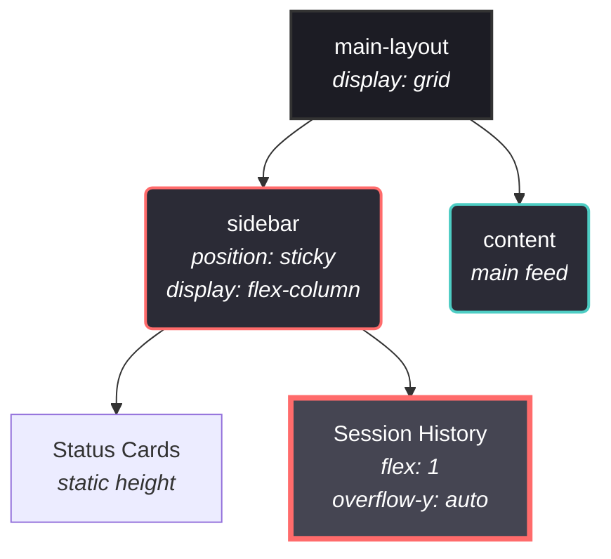

# UI Layout Defect Analysis & Resolution: Session History Overflow

## Background Context
During the recent development iterations, a layout issue emerged where the Session History inside the left sidebar lost its ability to scroll and began expanding indefinitely alongside new log entries. 

This bug was inadvertently triggered by commit `0333bd83c8e294bb995f869b5a12c3c588c713e6`, which introduced layout changes attempting to fix a secondary visual bug—a massive gap being rendered between the `ProjectBoard` and the `ConchShellPanel` whenever the left sidebar was collapsed.

This document serves to exhaustively analyze why this layout collision occurred, review the system's grid/flexbox architecture, and thoroughly defend the CSS changes necessary to fix the application's scrolling logic without reverting the previous gap fix.

---

## Architectural Review of the Layout Defect

### The Original Gap Bug
Before commit `0333bd8`, the `.sidebar` element possessed a global `height: 100%` property. 

Since the sidebar sits inside `.main-layout`—a 2-column CSS Grid where the right column contains highly expansive elements like the `ChatroomView` (600px max height) and the `ProjectBoard`—the `height: 100%` on the sidebar inadvertently tied the sidebar's total height to the Grid's maximum tracked row height. 

When the user invoked "Collapse Sidebar," the UI simply pushed the grid width to `0px` for the left column. However, because the sidebar still maintained layout weight and a defined expansive height relative to the grid layout tree, the browser rendered empty ghost space below the grid, causing a jarring gap above the subsequent `ConchShellPanel`.

### The Cause of the Scrolling Bug
To fix the gap, the prior commit (`0333bd8`) made two primary changes:
1. Defined explicit collapse rules (`height: 0`, `overflow: hidden`) on `.main-layout.sidebar-collapsed .sidebar`.
2. Removed `height: 100%` from the active `.sidebar` entirely.

While preventing ghost spacing, the removal of the explicit height unbound the `.sidebar` vertically. 

The sidebar operates as a `flex-column` parent, and the Session History card acts as a `flex: 1` child designed to fill the remaining vertical estate and trigger `overflow-y: auto`. Under the CSS Flexbox specification, a `flex: 1` child can only evaluate its intrinsic vertical layout boundaries if the parent has a determinable, finite height. Because the `.sidebar`'s height became implicit (determined completely by its children), the Session History card assumed an unbounded vertical container. Consequently, the card abandoned scrolling capabilities and just grew in raw height to continually wrap the injected chat history. 

### Visualizing the DOM Hierarchy 



*Diagram: `Session History` relies entirely on a constrained dimension from `.sidebar` to properly invoke its inner scrollbar. Without an explicit height on the sidebar, the grid layout forces infinite vertical stretch.*

---

## Defensive Code Modifications

To resolve the layout dispute, both requirements must be simultaneously met:
1. The sidebar must not dictate grid heights implicitly when collapsed.
2. The sidebar must provide a calculable limit for the Session History flex-child to trigger its internal scroll area.

### Implementation Solution

The modification anchors the sidebar to the viewport dynamically rather than bounding it to relative grid layouts.

**1. Re-binding the Viewport Height on `.sidebar`**
```css
.sidebar {
  /* Existing properties ... */
  position: sticky;
  top: 2rem;
  
  /* [NEW] The Fix */
  height: calc(100vh - 8rem);
}
```

**Defense of this constraint:** 
Instead of relying on the ambiguous scaling of `height: 100%`—which is susceptible to adopting the immense size of the `ProjectBoard` located in the neighboring grid track—restricting the element via `calc(100vh - 8rem)` achieves layout isolation. 

The sidebar becomes solely a function of the user's viewport screen estate. When `calc(100vh - 8rem)` acts against the `position: sticky` and the top margin constraints, the `.sidebar` strictly caps exactly where the screen ends. This instantly yields a deterministic maximum height for the `flex-column` parent, which successfully re-activates the `overflow-y: auto` boundary in the Session History card, allowing it to accurately swallow terminal overflow content and scroll properly.

**2. Verifying the Previous Fix (0333bd8)**
```css
.main-layout.sidebar-collapsed .sidebar {
  opacity: 0;
  pointer-events: none;
  transform: translateX(-20px);
  /* Unchanged overrides: */
  height: 0;
  margin: 0;
  padding: 0;
  overflow: hidden;
}
```

**Defense of preservation:** 
Because CSS specificity dictates that `.main-layout.sidebar-collapsed .sidebar` is structurally superior to the base `.sidebar` class, the explicit `height: 0` property forcefully overrides the new `height: calc(...)` viewport bound. Therefore, when collapsed, the sidebar correctly collapses into a non-interfering ghost layout size of 0. This unconditionally preserves the gap fix from `0333bd83c8e294bb995f869b5a12c3c588c713e6` while restoring the original intent of the Session History logs. 

---

## 3. The Secondary Defect: History Array Truncation

During verification of the CSS fixes, a secondary layer to the scroll bug was discovered. The Session History component within `App.tsx` mapped the event logs using an arbitrary truncation operation:

```tsx
// Faulty Implementation (Pre-fix)
events.filter(...).reverse().slice(0, 10).map(...)
```

**Architectural implication:** Even after the `.sidebar` received a valid CSS container bounding box (`calc(100vh - 8rem)`), the children (event logs) were artificially prevented from physically exceeding the height of the bounding box. By hard-capping the UI loop at exactly 10 lines of history, the `.card` never achieved a true geometric `Y > 100%` condition. Consequently, the browser's `overflow-y: auto` trigger condition was perpetually starved of vertical overflow, rendering the history window un-scrollable and "half-empty".

**Implementation Solution:**
```tsx
// Correct Implementation (Post-fix)
events.filter(...).reverse().map(...)
```

**Defense of this modification:** 
Removing the `.slice(0, 10)` constraint conceptually aligns the React rendering logic with the CSS Flexbox logic. The CSS container represents the physical bounding window; the internal array dictates the true length of the scroll context. React should not artificially truncate data solely for UI reasons if the CSS Architecture (`overflow-y: auto`) natively supports dynamic overflow limits. The UI is now capable of digesting infinite historical events and rendering them correctly behind a bounded viewport scroll-wheel.
