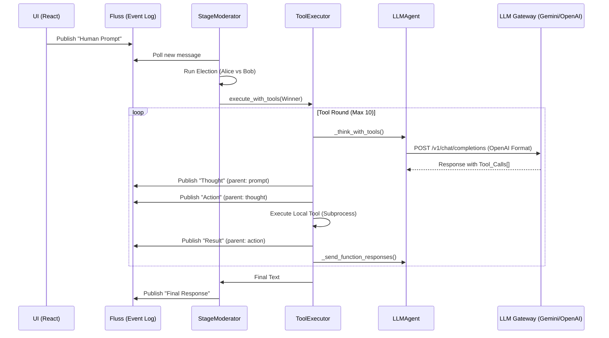

# 🦀 ContainerClaw: E2E Agent Tool-Call Protocol

The fundamental challenge in autonomous agents is maintaining a **Linear Narrative** for the user while the agent executes a **Recursive DAG (Directed Acyclic Graph)** of tool calls.

## 1. First Principles: The "Speed of Light" Architecture
In an optimal system, the latency of an agent's thought is limited only by:
1. **$L_{llm}$**: The Inference Time (TTFT + Token generation).
2. **$L_{io}$**: The execution time of the tool (e.g., a subprocess or network call).
3. **$L_{log}$**: The persistence of the event to the "Central Nervous System" (Fluss).

The ContainerClaw architecture uses **Event Sourcing** via Apache Fluss to ensure that the UI never "polls" for state, but rather "reconstructs" the trace from the log.

---

## 2. The E2E Workflow (Execution Trace)

When a human sends a prompt, the system initiates the following sequence. The "Traces" you see in high-end UIs (like ChatGPT) are achieved here through the `parent_event_id` and `edge_type` metadata.

### A. The Orchestration Sequence


### B. The Trace DAG (How the UI Builds "Collapsible Blocks")
Every event published to Fluss contains a `parent_event_id`. This allows the UI to render a tree:
* **Prompt (Root)**
    * **Thought (Node 1)** — *Collapsible*
        * **Action: `ls -R` (Node 2)**
            * **Result: `file1.py...` (Node 3)**
    * **Thought (Node 4)**
        * **Action: `read_file` (Node 5)**
            * **Result: `content...` (Node 6)**

---

## 3. Variable Flow & Context Isolation

The system manages two distinct types of memory during a tool call:

### 1. `all_messages` (The Session History)
* **Stored in:** Fluss / `StageModerator.context`.
* **Lifetime:** Permanent (across the entire session).
* **Content:** High-level thoughts and finalized responses. It does **not** usually include every raw tool result to avoid context window "trash".

### 2. `_api_turns` (The Tool Buffer)
* **Stored in:** `LLMAgent._api_turns`.
* **Lifetime:** Ephemeral (cleared at the start of a new execution cycle).
* **Content:** The raw conversation between the agent and the LLM *within a single turn*. It contains the `assistant` message (requesting tool calls) and the `tool` messages (providing results).

---

## 4. Provider Variance: Translation Logic

The `LLM Gateway` acts as a polyfill, allowing the Agent to speak a single language (OpenAI Wire Format) while using diverse backends.

| Provider | Mechanism | Traces/Thinking Handling |
| :--- | :--- | :--- |
| **OpenAI / MLX** | Native Passthrough | Uses the standard `tool_calls` and `tool` role. |
| **Gemini** | **Strict Translation** | Maps OpenAI `tool` messages to Gemini `functionResponse` parts. It handles the `thought` and `thought_signature` fields via a hidden `_gemini_parts` variable to ensure internal "thinking" models (like Gemini 2.0) don't lose their state. |
| **Anthropic** | Map to `tool_use` | (Inferred from standard patterns) Converts standard function calls to Anthropic's XML-style or JSON block formats. |

### The Gemini "Thinking" Hack
In `gemini_strategy.py`, the code preserves the exact "parts" returned by Gemini:
```python
# Required to pass `thought` and `thought_signature` parts back to Gemini in identical form
message["_gemini_parts"] = parts 
```
This is a critical "Speed of Light" optimization: by echoing the exact internal state, the model doesn't have to "re-think" its plan in the next tool round.

---

## 5. Architectural Defense: Why the ToolExecutor Exists

The `ToolExecutor` was extracted from the `StageModerator` to solve the **Recursive Depth Problem**.

1.  **Circuit Breaking:** It halts after 3 consecutive failures. Without this, an agent in a "speed of light" loop could burn hundreds of dollars in API credits if it gets stuck in a syntax-error loop.
2.  **Adaptive Verbosity:** For read-heavy tools (like `repo_map`), the executor allows up to 8,000 characters of output. For standard tools, it caps at 2,000. This prevents "Context Overflow" which slows down the model's "thinking" speed.
3.  **Callback Injection:** The executor doesn't know about "Sessions" or "Fluss"; it only knows about `publish_fn` and `poll_fn`. This isolation is what allows ContainerClaw to eventually support **Parallel Subagents**.

## 6. Summary of Variables in a Tool Call

| Variable | Location | Purpose |
| :--- | :--- | :--- |
| `parent_event_id` | `tool_executor.py` | Anchors the current tool call to the previous thought for UI tree-rendering. |
| `current_parent` | `tool_executor.py` | The "moving head" of the DAG within a single turn. |
| `is_json=True` | `agent.py` | Forces the gateway to use `response_mime_type: application/json` for deterministic voting/elections. |
| `tool_choice="required"` | `tool_executor.py` | Forces the model to use a tool in the first round to prevent it from "talking" instead of "doing". |