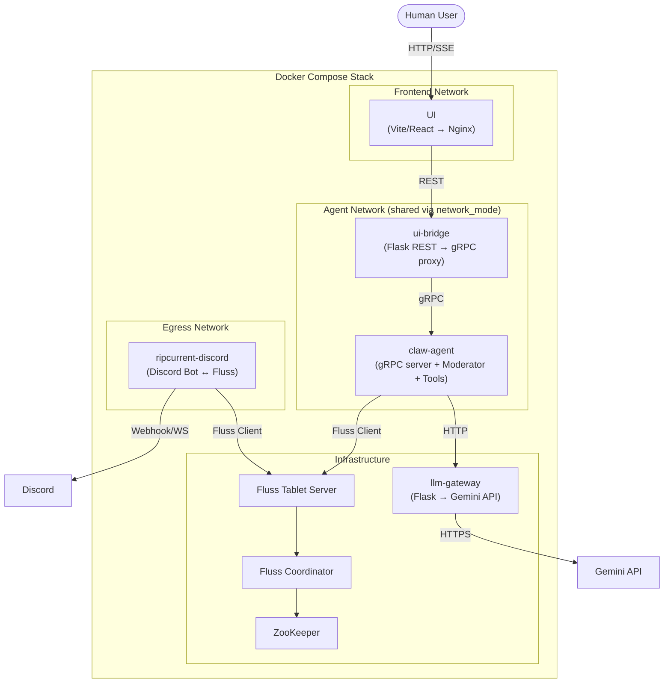
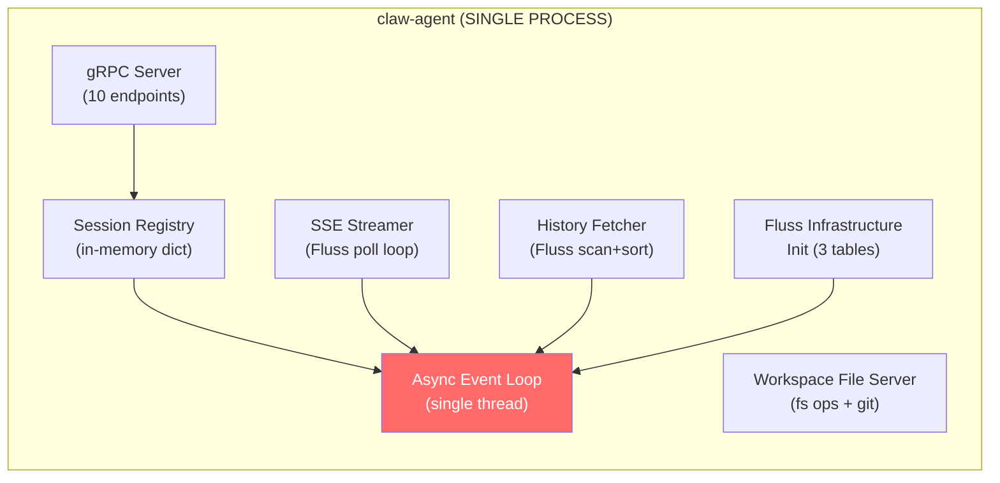
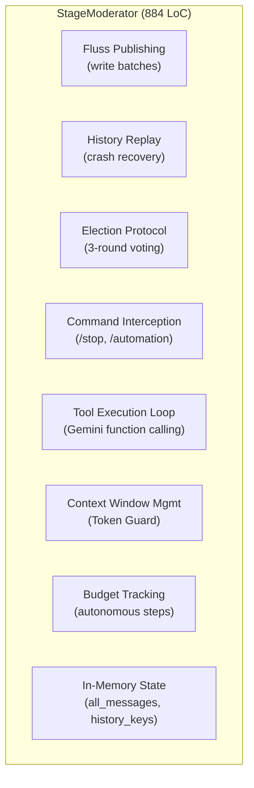
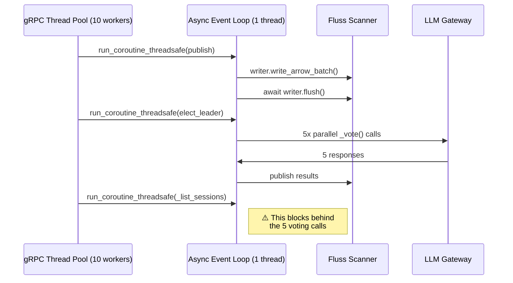
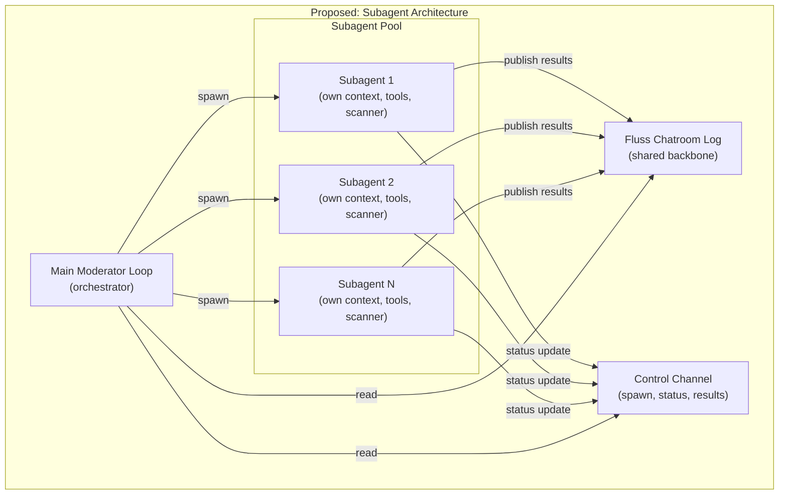
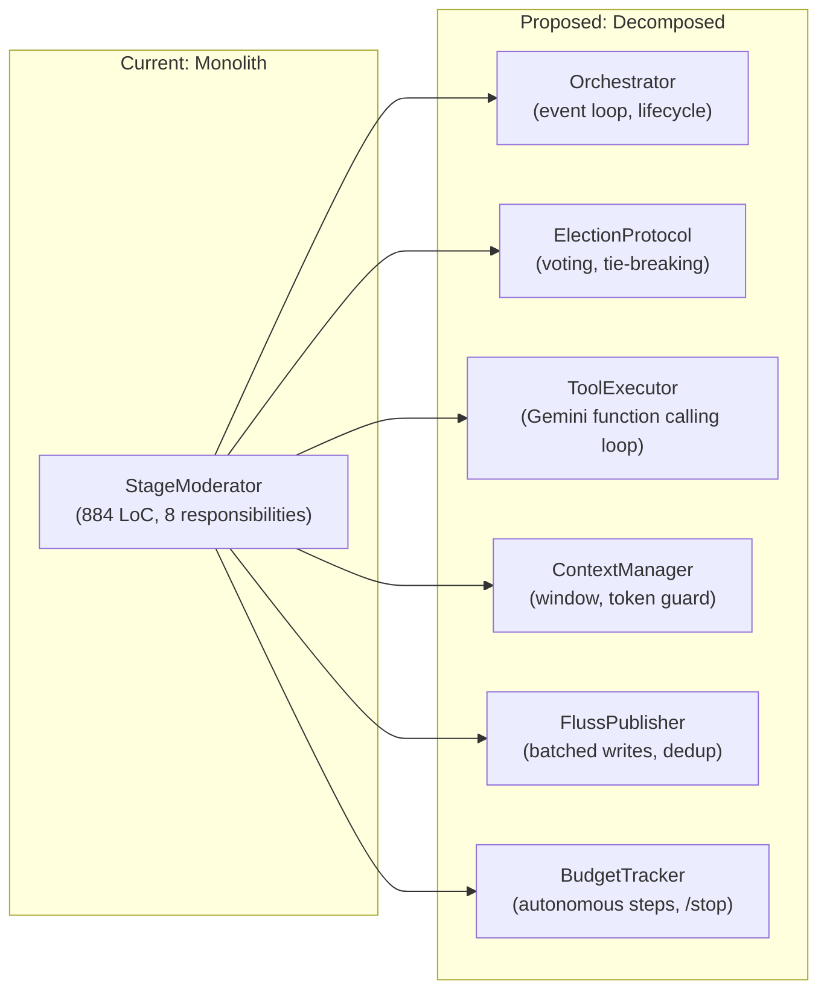

# State of Code: Architectural Review — Part 1

> **Date:** 2026-03-25  
> **Scope:** Full codebase analysis of ContainerClaw as of current HEAD  
> **Goal:** Determine whether the existing architecture is on an optimal path for the roadmap in `regression_test.md`, or whether fundamental refactoring is needed before the next phase of features — particularly subagent parallelism.

---

## 1. System Topology (Current)



### Component Inventory

| Component | File | LoC | Responsibility |
|---|---|---|---|
| `claw-agent` | `agent/src/main.py` | 681 | gRPC server, Fluss table init, session management, history retrieval |
| StageModerator | `agent/src/moderator.py` | 884 | Multi-agent election loop, Fluss publish, command interception, tool execution |
| ConchShell Tools | `agent/src/tools.py` | 923 | 11 tool implementations + ToolDispatcher |
| Config | `agent/src/config.py` | 17 | Environment variable loader |
| ui-bridge | `bridge/src/bridge.py` | 233 | Flask REST proxy to gRPC |
| RipCurrent | `ripcurrent/src/main.py` | 250 | Discord ↔ Fluss bidirectional sync |
| LLM Gateway | `llm-gateway/src/main.py` | 93 | Gemini API proxy with connection pooling |
| Proto | `proto/agent.proto` | 125 | 10 RPCs, 12 message types |
| **Total Backend** | | **~3,200** | |

---

## 2. Architectural Assessment: Honest Diagnosis

### Verdict: 🟡 **Partially Sound, but Structurally Fragile**

The system **works** — the core loop (human message → Fluss → election → tool execution → Fluss → UI) is functional and the Fluss-centric design is genuinely novel. However, the architecture has accumulated **structural debt** that will make every future feature disproportionately expensive. The "massive code changes for superficial additions" feeling is not an illusion — it's a symptom of several concrete anti-patterns.

---

## 3. Anti-Patterns Identified

### 3.1 The God Process: `main.py` + `moderator.py`

**The problem:** The `claw-agent` container runs a *single Python process* that is simultaneously:

1. A **gRPC server** (10 RPCs)
2. A **Fluss infrastructure initializer** (3 tables, retry loops)
3. A **session registry** (in-memory `self.moderators` dict)
4. A **real-time event streamer** (SSE via Fluss polling)
5. A **chat history fetcher** (Fluss scan + sort)
6. A **workspace file server** (directory listing, file reading, git diff)
7. An **async event loop manager** (dedicated thread for all coroutines)



**Why this breaks:** The single async event loop is a **chokepoint**. Every gRPC handler (`ExecuteTask`, `StreamActivity`, `GetHistory`, `ListSessions`) calls `asyncio.run_coroutine_threadsafe(...)` to dispatch work to the same loop. During an active multi-agent turn (5 agents voting, tool execution, Fluss polling), a `ListSessions` call competes with tool execution for the same event loop. There is *no backpressure*, *no priority*, and *no isolation*.

**Impact on subagents:** Subagent parallelism requires independent event loops or at minimum independent task queues. The current architecture makes this impossible without fundamentally changing the threading model.

---

### 3.2 Schema Duplication (The "Four Sources of Truth" Problem)

The Fluss chatroom schema is defined **four separate times** in the codebase:

| Location | Usage |
|---|---|
| `main.py:602-611` | Table creation during `init_infrastructure()` |
| `moderator.py:345-354` | `StageModerator.__init__()` for write batches |
| `ripcurrent/main.py:196-205` | `push_to_fluss()` for Discord ingress writes |
| `tools.py:199-209` | `ProjectBoard.__init__()` for board events schema |

Each is a hand-constructed `pa.schema([...])`. If any field changes, all four must be updated in lockstep. This has **already caused bugs** — the conversation history shows multiple sessions debugging Arrow column access errors and `bytes` vs `string` type mismatches.

**Defense of fix:** A single `schemas.py` module exporting `CHATROOM_SCHEMA`, `SESSIONS_SCHEMA`, `BOARD_EVENTS_SCHEMA` would eliminate this class of bug entirely. This is table stakes for any data pipeline.

---

### 3.3 The Moderator Is a Monolith Within a Monolith

`StageModerator` at 884 lines is doing too much:



The class has **8 orthogonal responsibilities** jammed together. Adding the `/clear-workspace` command from the roadmap means touching the same file that handles election logic, tool execution, and Fluss publishing. This is why "superficial additions" cause "massive code changes."

**Concrete coupling example:**
- `_handle_single_message()` is called by both `_replay_history()` (startup) and `publish()` (runtime). It handles command parsing (`/stop`, `/automation=X`), deduplication, and in-memory state updates — all in one method. Adding `/normal=true` or `/tool-mute` means adding more branches to an already complex method, which in turn affects replay behavior during crash recovery.

---

### 3.4 Fluss: The Right Backbone, Poorly Leveraged

> "I am not confident yet in the Fluss backend"

Here's the nuanced answer: **Fluss as the backbone is the correct design decision.** But the current *usage* of Fluss has problems:

#### ✅ What Fluss Gets Right

1. **Append-only event log** → Natural fit for chat messages, board events, session lifecycle
2. **Timestamp-based seeking** → Efficient history retrieval without full scans
3. **Multi-consumer** → RipCurrent and claw-agent can independently tail the same log
4. **Crash recovery** → Replay from log on restart (moderator does this)
5. **Bucket keys** → Session-based partitioning is correct

#### ❌ What the Current Usage Gets Wrong

| Issue | Current State | Correct Pattern |
|---|---|---|
| **No idempotency tokens** | Messages keyed by `{ts}-{actor_id}` — a race condition can produce duplicate keys if two agents publish in the same millisecond | Use a proper `event_id` (UUID or monotonic counter) as the dedup key |
| **Polling instead of subscribing** | `scanner.poll_arrow(timeout_ms=500)` in tight loops with empty-poll counters | Use Fluss's subscription API properly — let the consumer block on new data |
| **Hardcoded bucket count** | `range(16)` appears 12 times in the codebase | Should be a constant or derived from table metadata |
| **No write batching** | Each `publish()` call creates a single-row RecordBatch | Batch multiple events into a single write for throughput |
| **Sync-over-async Fluss access** | `asyncio.to_thread(scanner.poll_arrow, ...)` wraps synchronous calls | The Fluss Python SDK already has async support — use it natively |
| **Session listing via full scan** | `_list_sessions_async()` scans all 16 buckets with empty-poll heuristic (5 empty polls = done) | Sessions table should be a PK table (was attempted, then reverted due to bugs) |

**The sessions table revert** (from PK table to log table) was a pragmatic fix but fundamentally the wrong direction. A sessions registry naturally wants point-lookups and upserts (PK table semantics). The revert traded correctness for stability, creating the current O(N) scan for session lookups.

---

### 3.5 Thread Model: The gRPC-Async Bridge



The gRPC server is synchronous (using `concurrent.futures.ThreadPoolExecutor`), but all actual work is dispatched to a single asyncio event loop via `run_coroutine_threadsafe()`. This creates:

1. **Head-of-line blocking:** A slow LLM call blocks all session listing/history queries
2. **No CPU parallelism:** Python's GIL + single event loop = effectively single-threaded
3. **Future timeout fragility:** `future.result(timeout=30)` sprinkled throughout — if the loop is saturated, these will silently timeout causing gRPC errors

**For subagent parallelism:** This model fundamentally cannot support N parallel agent execution contexts. Each subagent would need its own execution context (at minimum its own `asyncio.Task`, ideally its own process/container).

---

### 3.6 Agent Identity & Context Isolation

Currently, all 5 agents (`Alice`, `Bob`, `Carol`, `David`, `Eve`) share:
- The **same event loop**
- The **same context window** (`_get_context_window()`)
- The **same tool instances** (shared `SessionShellTool`, `ProjectBoard`, etc.)
- The **same LLM gateway** (no per-agent rate limiting)

The only per-agent state is `_api_turns` (function calling turn buffer), which is explicitly reset at the start of each execution cycle.

**For subagents:** A subagent that runs independently needs:
- Its own Fluss scanner (or subscription)
- Its own context window
- Its own tool sandbox
- Its own LLM quota
- A way to *publish results back* to the main stream

None of these isolation boundaries exist in the current code.

---

## 4. The Subagent Question: Can We Get There From Here?

### What Subagent Parallelism Requires



### Requirements Checklist

| Requirement | Current Support | Gap |
|---|---|---|
| Independent execution context per agent | ❌ Shared event loop | Need process/task isolation |
| Independent tool sandbox | ❌ Shared tool instances | Need per-agent tool factories |
| Independent Fluss subscription | ❌ Shared scanner | Trivial to add (Fluss supports multi-consumer) |
| Result publication to main stream | ✅ `publish()` writes to Fluss | Already works |
| Spawn/kill lifecycle management | ❌ No concept exists | Need a SubagentManager |
| Status reporting (thinking/working/done) | ❌ No concept exists | Need a control channel (could be another Fluss table) |
| Back-pressure / resource limits | ❌ No limits | Need per-subagent resource quotas |

### Assessment: **Refactor Required, Not Rewrite**

The Fluss backbone is the correct foundation. The subagent model maps naturally onto it:
- Each subagent publishes to the same chatroom log (with a `parent_actor` field that already exists!)
- The main moderator subscribes to the same log and sees subagent outputs
- Status updates can go to a dedicated `agent_status` Fluss table
- Spawning = creating a new `asyncio.Task` (or subprocess) with its own `StageModerator`-like loop

But the current `StageModerator` class is not decomposable enough to extract the reusable parts. It needs to be broken apart first.

---

## 5. Refactoring Roadmap: The Critical Path

### Phase 0: Foundation (Must Do Before ANY New Feature)

These changes are mechanical and risk-free. They eliminate the structural debt that makes every feature addition expensive.

#### 5.0.1 Extract `schemas.py`
Single source of truth for all Fluss schemas.
```
agent/src/schemas.py  [NEW]
├── CHATROOM_SCHEMA
├── SESSIONS_SCHEMA
├── BOARD_EVENTS_SCHEMA
└── AGENT_STATUS_SCHEMA (for future use)
```
**Files changed:** `main.py`, `moderator.py`, `ripcurrent/main.py`, `tools.py`  
**Risk:** Zero — pure extraction.

#### 5.0.2 Extract `fluss_client.py`
Encapsulate all Fluss operations (connection, table creation, scan, publish) behind a clean interface.
```
agent/src/fluss_client.py  [NEW]
├── class FlussClient
│   ├── connect()
│   ├── ensure_tables()
│   ├── publish(table, batch)
│   ├── create_scanner(table, start_ts?)
│   └── list_sessions()
```
**Why:** Currently, *every file* that touches Fluss reimplements connection logic, schema construction, and polling loops. This is the #1 source of bugs.

#### 5.0.3 Extract `commands.py`
Command interception (currently embedded in `_handle_single_message`) should be a standalone dispatcher.
```
agent/src/commands.py  [NEW]
├── class CommandDispatcher
│   ├── register(command, handler)
│   ├── dispatch(content) -> bool  (returns True if was a command)
│   └── built-in: /stop, /automation, /clear-workspace, /normal, /tool-mute
```
**Why:** Every new `/command` currently requires modifying `_handle_single_message()`, which also handles deduplication and history recording. Separation allows adding commands without touching core message flow.

#### 5.0.4 Split `AgentService` from Fluss Init
The gRPC service handler (`AgentService`) should not be responsible for infrastructure initialization. Extract `init_infrastructure()` into its own module.

---

### Phase 1: Decompose the Moderator



This decomposition is not arbitrary — each extracted class has a **single reason to change:**

| Class | Changes When... |
|---|---|
| `Orchestrator` | The main loop lifecycle changes (e.g., adding subagent spawning) |
| `ElectionProtocol` | Voting logic changes (e.g., adding a "final review agent" from roadmap) |
| `ToolExecutor` | Tool execution protocol changes (e.g., parallel tool calls) |
| `ContextManager` | Context window strategy changes (e.g., per-agent context, RAG) |
| `FlussPublisher` | Write batching, deduplication, or schema changes |
| `BudgetTracker` | Autonomy/control logic changes (e.g., per-agent budgets for subagents) |

---

### Phase 2: Introduce `AgentContext` for Isolation

```python
# Proposed: agent/src/agent_context.py
class AgentContext:
    """Isolated execution environment for a single agent (or subagent)."""
    
    def __init__(self, agent_id, session_id, fluss_client, llm_gateway):
        self.agent_id = agent_id
        self.session_id = session_id
        self.fluss_client = fluss_client
        self.llm_gateway = llm_gateway
        self.context_window = ContextManager()
        self.tool_dispatcher = ToolDispatcher(...)
        self.budget = BudgetTracker(...)
        self.scanner = None  # Own Fluss subscription
    
    async def run(self):
        """Independent agent loop — can run as asyncio.Task or subprocess."""
        ...
    
    async def publish(self, content, msg_type):
        """Publish to the shared Fluss log with proper parent_actor attribution."""
        ...
```

**This is the critical abstraction for subagents.** With `AgentContext`, spawning a subagent is:
```python
ctx = AgentContext("Subagent-1", session_id, fluss, llm)
asyncio.create_task(ctx.run())
```

And it automatically:
- Has its own context window (doesn't pollute the main conversation)
- Has its own tool sandbox
- Publishes results back to Fluss (visible to main moderator + UI)
- Can be independently killed/paused

---

### Phase 3: Restore Sessions PK Table

The sessions table **must** be a PK table. The current log-table scan is O(N) in the number of sessions ever created and will not scale. The original PK approach was correct; the bugs were likely:

1. **Not awaiting the writer flush** (async method called synchronously) — already fixed
2. **Using `create_writer()` on append for PK tables** — PK tables may need `upsert` semantics

This should be re-attempted with proper testing.

---

## 6. The "Kubernetes Analogy" — Design Principles

You asked for "Google-level attention to design details." Here's how to think about it:

| Kubernetes Concept | ContainerClaw Equivalent | Current State | Target State |
|---|---|---|---|
| **Pod** | `AgentContext` | Doesn't exist; agents are methods on `StageModerator` | Isolated runtime with own lifecycle |
| **Controller** | `Orchestrator` | Embedded in `StageModerator.run()` | Standalone reconciliation loop |
| **CRD** | Fluss table schemas | Duplicated 4x | Single `schemas.py` |
| **etcd** | Fluss | ✅ Already the correct choice | Improve access patterns |
| **kubelet** | `ToolExecutor` | Embedded in moderator | Standalone tool execution runtime |
| **API Server** | `AgentService` (gRPC) | Also does init, session mgmt, file serving | Pure API surface |
| **Scheduler** | `ElectionProtocol` | Effective but tightly coupled | Extractable, composable |

The key insight from Kubernetes: **every component should be a reconciliation loop against a shared state store.** Fluss *is* that state store. But the current code treats Fluss as a dumb append log instead of leveraging it as the coordination primitive.

---

## 7. What's Actually Fine (Don't Touch)

Not everything needs refactoring. These components are well-designed:

1. **`tools.py` base abstraction:** The `Tool` → `ToolResult` → `ToolDispatcher` pattern is clean and extensible. Adding new tools is easy.
2. **`llm-gateway`:** Simple, single-responsibility proxy. Connection pooling + retry is correct.
3. **`bridge.py`:** Thin REST-to-gRPC proxy. Does exactly one thing.
4. **Network segmentation** in `docker-compose.yml`: `frontend`, `internal`, `egress` separation is production-grade.
5. **Docker security posture:** `read_only`, `cap_drop: ALL`, `no-new-privileges`, resource limits.
6. **The election protocol itself:** 3-round voting with debate mode is genuinely interesting and works.
7. **The `parent_actor` field:** Already exists in the chatroom schema — prescient design for subagent attribution.

---

## 8. Risk Matrix: Feature Roadmap vs Architecture

For each planned feature from `regression_test.md`, here's the architectural readiness:

| Planned Feature | Architectural Readiness | Blocking Issue |
|---|---|---|
| `/clear-workspace` | 🟡 Moderate | Must modify `_handle_single_message()` — gets worse without command extraction |
| `/normal=true/false` | 🟡 Moderate | Needs agent-level context control that doesn't exist |
| `/tool-mute`, `/tool-unmute` | 🟡 Moderate | Requires per-stream filtering — no abstraction exists |
| Snorkel (context window inspection) | 🔴 Hard | `_api_turns` is ephemeral, context window isn't persisted |
| **Subagents** | 🔴 Hard | Requires `AgentContext` isolation (Phase 2) |
| Telemetry / SQL queries on Fluss | 🟢 Easy | Fluss already supports this via Flink SQL |
| Agent status indicators | 🟡 Moderate | Need a status Fluss table + UI subscription |
| Flink metrics | 🟢 Easy | Fluss exposes JMX metrics natively |
| Iceberg tiering | 🟢 Easy | Fluss roadmap includes this |
| Move config to root | 🟢 Easy | Trivial |
| Final review agent (GenSelect) | 🟡 Moderate | Election protocol needs to be extractable first |
| Google Workspace integration | 🟡 Moderate | Follows RipCurrent pattern — but that pattern has no abstraction |
| GitHub integration | 🟡 Moderate | Same as above |
| Agent web browsing | 🔴 Hard | Requires sandboxed browser, new tool type |
| Read-only repo access | 🟢 Easy | Docker volume mount |
| Kaggle/autoresearch | 🔴 Hard | Requires subagent loops with iteration tracking |
| Kubernetes integrations | 🔴 Hard | Requires the full decomposition |

**Key insight:** 5 of the 17 planned features are blocked or severely impacted by the lack of agent isolation (`AgentContext`). 4 more are blocked by the lack of a command dispatcher. Only 3 are trivially addable without refactoring.

---

## 9. Concrete Refactoring Plan with Effort Estimates

### Immediate (Before Next Feature Add) — ~2 Days

| Task | Files | Effort | Risk |
|---|---|---|---|
| Create `schemas.py` | 4 files modified | 2 hours | Zero |
| Create `commands.py` | 1 new, 1 modified | 4 hours | Low |
| Extract `init_infrastructure()` to `infra.py` | 2 files modified | 2 hours | Low |
| Extract `FlussPublisher` from `StageModerator` | 2 files modified | 4 hours | Low |

### Short-Term (This Sprint) — ~1 Week

| Task | Files | Effort | Risk |
|---|---|---|---|
| Decompose `StageModerator` into 5 classes | 3 files modified, 5 new | 2 days | Medium |
| Create `AgentContext` abstraction | 1 new, 2 modified | 1 day | Medium |
| Add `agent_status` Fluss table | 3 files modified | 4 hours | Low |
| Re-attempt sessions PK table | 2 files modified | 4 hours | Medium |

### Medium-Term (Next Sprint) — ~2 Weeks

| Task | Files | Effort | Risk |
|---|---|---|---|
| Implement `SubagentManager` | 2 new | 2 days | High |
| Add control channel (Fluss table for subagent lifecycle) | 3 files modified | 1 day | Medium |
| UI support for subagent status | 3 files | 2 days | Medium |
| Extract RipCurrent into generic "Integration" pattern | 3 files | 1 day | Low |

---

## 10. Conclusion: Refactor, Don't Rewrite

The fundamental design choice — **Fluss as the coordination backbone for a multi-agent system** — is correct and differentiating. No other known agentic pipeline uses a streaming log as the primary coordination primitive. This gives ContainerClaw several inherent advantages:

1. **Natural event sourcing:** Every state change is recorded → crash recovery is free
2. **Multi-consumer:** Adding new consumers (Discord, GitHub, Slack, telemetry dashboards) is just tailing the log
3. **Temporal queries:** "What did the agents do between time T1 and T2?" is a Fluss query
4. **Subagent coordination:** Publishing to a shared log is the most natural way for independent agents to communicate

But the current code **doesn't respect this design**. It treats Fluss as a side-effect (publish → poll → process in a tight loop) rather than as the **central nervous system** (subscribe → react). The refactoring path is clear:

1. **Immediately:** Extract schemas, commands, and Fluss client to eliminate structural duplication
2. **This sprint:** Decompose the moderator to enable independent component evolution
3. **Next sprint:** Introduce `AgentContext` for subagent isolation
4. **Then:** Subagents are a natural extension, not a rewrite

The architecture is **80% there**. The remaining 20% is the difference between a system that bends under every new feature and one that absorbs complexity gracefully.

**The stream-centric approach should be the documented backbone.** Every component should be described as "a consumer/producer on the Fluss event log" — and the code should enforce that boundary. Right now, the code says "Fluss" but the structure says "big function that does everything."

---

*Next: `state_of_code_pt2.md` — Detailed refactoring PRs with file diffs, Fluss access pattern optimization, and the subagent control protocol design.*
