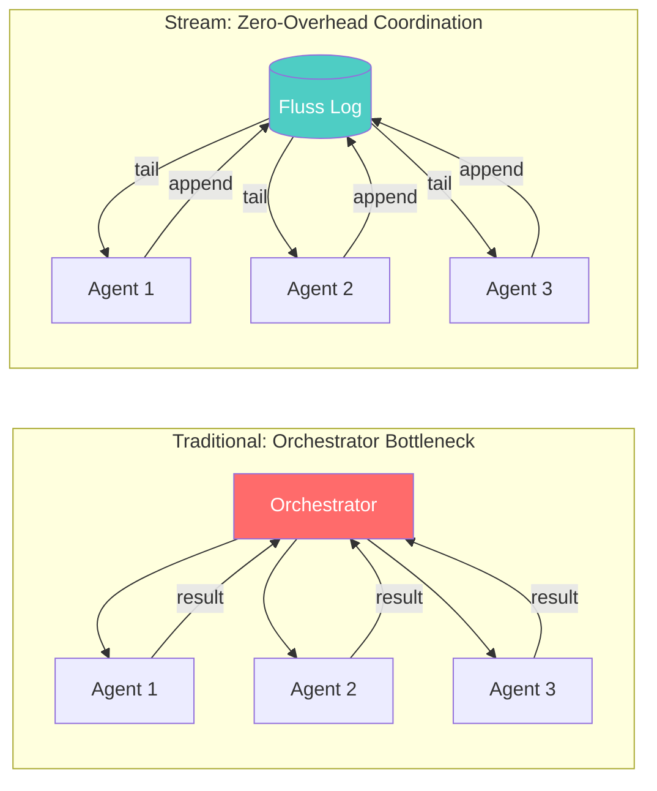
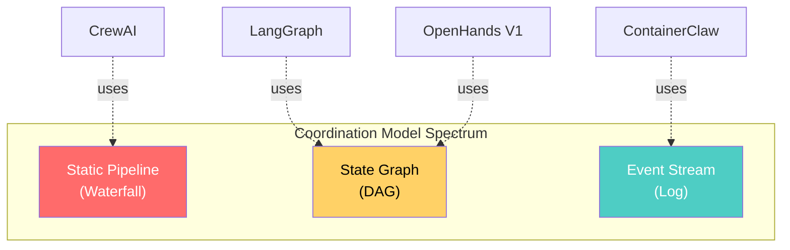
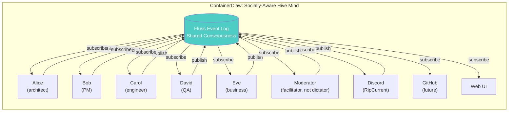
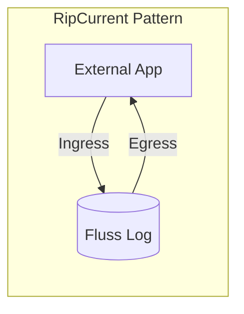
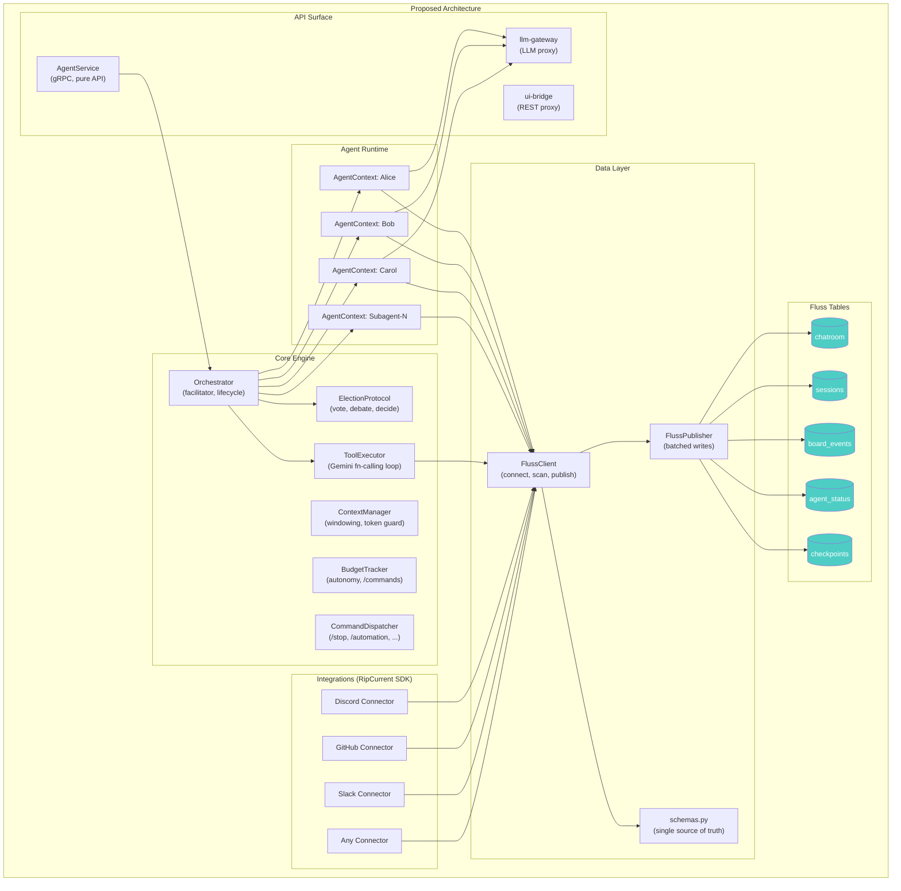

# State of Code: Architectural Review — Part 2

> **Date:** 2026-03-25  
> **Scope:** Fluss API optimization, competitive differentiation, RipCurrent plugin architecture, speed/resilience first-principles  
> **Prerequisite:** Read [state_of_code_pt1.md](./state_of_code_pt1.md) first.

---

## 1. First Principles: The Stream as Physics

Before proposing changes, we need to establish *why* a stream-centric architecture is fundamentally superior for agentic AI — starting from physics.

### The Speed-of-Light Constraint

In any distributed system, the irreducible cost is **propagation delay**. When Agent A produces an insight, the minimum time for Agent B to react is:

```
t_react = t_serialize + t_network + t_deserialize + t_process
```

Traditional architectures (REST polling, pub/sub, RPC) add **coordination overhead** on top of this:

```
t_traditional = t_react + t_orchestrator_routing + t_state_sync + t_lock_contention
```

A stream-centric architecture (Fluss) collapses the coordination overhead:

```
t_stream = t_react + t_log_append  (≈ 0 additional overhead)
```

**Why?** Because in a log-based system:
- There is **no router** — every consumer sees every event
- There is **no state sync** — the log *is* the state (event sourcing)
- There is **no lock contention** — append is O(1) and lock-free
- There is **no orchestrator bottleneck** — consumers advance independently



### Why This Matters for AI Agents

LLM-powered agents have a unique performance profile:
- **LLM inference is slow** (~1-10s per call)
- **Tool execution is fast** (~10-100ms)
- **Human input is unpredictable** (0-∞ latency)

This means the bottleneck is *never* the coordination layer — it's always the LLM. A stream-centric system optimizes for this by eliminating coordination overhead entirely, ensuring that **100% of wall-clock time is spent on useful work** (LLM calls, tool execution) rather than orchestration bookkeeping.

### The Idempotency Guarantee

Event-sourced systems get idempotency for free:

1. **Every mutation is an event** in the log
2. **State is derived** by replaying events
3. **Replaying the same events produces the same state**
4. **Crash recovery = replay from last checkpoint**

This is fundamentally more robust than orchestrator-managed state, where crashes require complex recovery protocols to determine "where were we?"

---

## 2. Competitive Differentiation Analysis

### 2.1 The Landscape



| Framework | Coordination Model | State Management | Agent Communication | Extensibility | Parallelism |
|---|---|---|---|---|---|
| **CrewAI** | Sequential/Hierarchical (imperative) | In-memory Python dicts | Method calls between agents | Role-based delegation | Limited (sequential process) |
| **LangGraph** | StateGraph (compile-time DAG) | Reducer-driven TypedDict | Node edges (static routing) | New nodes in graph | Fork/join via graph branches |
| **OpenHands V1** | EventStream + AgentController | Stateless event processor | EventStream (in-memory) | SDK-based tool system | Sub-agent delegation |
| **ContainerClaw** | Fluss event log (runtime stream) | Event-sourced from Fluss | Shared log (decentralized) | RipCurrent connectors | **Native** (independent consumers) |

### 2.2 Why the Stream Model Wins

#### CrewAI: The Dictator Problem

CrewAI uses **imperative orchestration** — a `Crew` object explicitly calls agents in sequence or via a hierarchical manager. This is the "dictator model":

```python
# CrewAI: Static, imperative pipeline
crew = Crew(agents=[researcher, writer], tasks=[research_task, write_task], process=Process.sequential)
crew.kickoff()  # Agents execute in fixed order
```

**Limitations:**
- Agent order is hardcoded at definition time
- No runtime adaptation to changing priorities
- Manager agent is a single point of failure
- Adding a new agent requires modifying the Crew definition

#### LangGraph: The Graph Problem

LangGraph uses **compile-time state graphs** — agent interactions are defined as a DAG with static edges:

```python
# LangGraph: Compile-time graph definition
graph = StateGraph(AgentState)
graph.add_node("researcher", researcher_node)
graph.add_node("writer", writer_node)
graph.add_edge("researcher", "writer")
app = graph.compile()  # Graph is frozen
```

**Limitations:**
- Graph topology is fixed after `compile()`
- Conditional edges exist but are vertex-level, not edge-level
- State reducers must be predefined — can't handle emergent agent roles
- No native distributed execution — runs in a single Python process

#### OpenHands V1: The Closest Competitor

OpenHands V1 (Nov 2025) uses an `EventStream` as its "central nervous system" — very similar to ContainerClaw's approach:

```python
# OpenHands V1: Event-driven architecture
event_stream = EventStream()
agent_controller = AgentController(agent, event_stream)
agent_controller.run()  # Processes events step-by-step
```

**Key differences from ContainerClaw:**
- OpenHands' EventStream is **in-memory** — no persistence, no crash recovery, no multi-process consumers
- OpenHands uses a **single AgentController** — no decentralized election
- OpenHands' agents are **stateless event processors** — good for isolation, but no collective intelligence
- Sub-agent delegation exists but via **explicit task assignment**, not organic emergence

### 2.3 ContainerClaw's Unique Position

ContainerClaw's key differentiator is that the stream *is* the coordination mechanism — not an observation channel bolted onto an orchestrator.



**The hive mind advantage:** Every agent sees *everything* — including other agents' tool outputs, votes, and reasoning. This creates emergent social dynamics:
- Agents learn each other's strengths through observation
- Voting creates natural task assignment without a manager
- New agents join by simply subscribing to the log
- Dead agents are naturally handled (they stop publishing)

**No other framework has this.** OpenHands is closest but lacks persistence and multi-consumer support. LangGraph and CrewAI operate at a fundamentally different (lower) level of abstraction.

### 2.4 Does the Orchestrator Eliminate Differentiation?

**No.** The proposed `Orchestrator` from Part 1 is not a traditional orchestrator — it's a **facilitator**:

| Traditional Orchestrator | ContainerClaw Orchestrator |
|---|---|
| Routes messages between agents | Just polls the log and triggers elections |
| Owns agent lifecycle | Agents are independent consumers |
| Holds authoritative state | State lives in Fluss (event-sourced) |
| Single point of failure | Can be restarted (log survives) |
| Defines execution order | Election protocol decides dynamically |

The Orchestrator is more like a **Kubernetes controller** — it watches the state store and reconciles, but doesn't *own* the state. The log always wins.

**Critical design rule:** The Orchestrator should never hold state that isn't derivable from the Fluss log. If the Orchestrator crashes and restarts, it must be able to reconstruct its world by replaying the log. This is already partially true (the `_replay_history()` method) but needs to be made rigorous.

---

## 3. Fluss API Optimization: The `async for` Revolution

### 3.1 Current State: Manual Polling Hell

The codebase currently uses the old-style batch polling API everywhere:

```python
# Current: 12 instances of this pattern
scanner = await table.new_scan().create_record_batch_log_scanner()
for b in range(16):  # ← hardcoded bucket count
    scanner.subscribe(bucket_id=b, start_offset=0)

while True:
    poll = await asyncio.to_thread(scanner.poll_arrow, timeout_ms=500)  # ← sync wrapped in thread
    if poll.num_rows == 0:
        empty_polls += 1
        if empty_polls >= 5:
            break
        continue
    # process...
```

**Problems:**
1. `range(16)` hardcoded — breaks if bucket count changes
2. `asyncio.to_thread()` wrapping a synchronous call — unnecessary overhead
3. Empty-poll counting as "end of data" heuristic — fragile and incorrect
4. No backpressure — poll loop spins even when no data
5. Not idiomatic Python — feels like Java

### 3.2 New API: Issue #424 Async Iterator

The Fluss Rust bindings (your `table.rs`) now support `__aiter__` / `__anext__` on `LogScanner`, enabling:

```python
# New: Idiomatic async iteration
scanner = await table.new_scan().create_log_scanner()

# Dynamic bucket discovery (no hardcoded 16!)
num_buckets = (await admin.get_table_info(table_path)).num_buckets
scanner.subscribe_buckets({i: fluss.EARLIEST_OFFSET for i in range(num_buckets)})

# Beautiful and idiomatic
async for record in scanner:
    process(record.row)
```

Or for batch mode (what ContainerClaw currently uses):

```python
# Batch mode also supports async for
scanner = await table.new_scan().create_record_batch_log_scanner()
async for batch in scanner:  # yields RecordBatch objects
    for i in range(batch.num_rows):
        process(batch)
```

### 3.3 Performance Analysis

Under the hood, `__aiter__` is implemented in Rust as:

```python
# Generated by PyO3 (see table.rs:2226-2248)
async def _async_batch_scan(scanner, timeout_ms=1000):
    while True:
        batches = await scanner._async_poll_batches(timeout_ms)
        if batches:
            for rb in batches:
                yield rb
```

Key performance characteristics:
1. **`_async_poll_batches()` is truly async** — uses `future_into_py()` which integrates with Python's event loop natively via tokio, no `asyncio.to_thread()` needed
2. **Yields immediately** when data is available — no empty-poll counting
3. **Backpressure is natural** — consumer processes at its own speed
4. **Cooperative multitasking** — `await` yields control back to the event loop between polls

### 3.4 Migration Plan: Every Fluss Access Point

| Location | Current Pattern | New Pattern | Impact |
|---|---|---|---|
| `moderator.py:_replay_history()` | `poll_arrow` loop with empty-poll counter | `async for batch in scanner` | Simpler, correct termination |
| `moderator.py:run()` | `poll_arrow` in while-True loop | `async for record in scanner` (record mode) | Native async, no `to_thread` |
| `moderator.py:_poll_once()` | Single `poll_arrow` call via `to_thread` | `scanner._async_poll_batches(600)` directly | Eliminate thread dispatch |
| `main.py:StreamActivity()` | `poll_arrow` loop via `run_coroutine_threadsafe` | `async for batch in scanner` | Eliminate double-dispatch |
| `main.py:_list_sessions_async()` | `poll_arrow` loop with 5 empty polls | `async for batch in scanner` with `break` | Correct termination |
| `main.py:_fetch_history_async()` | `poll_arrow` loop with 10 empty polls | `async for batch in scanner` with `break` | Faster, no false timeouts |
| `ripcurrent/main.py:start_egress_worker()` | `poll_arrow` loop via `to_thread` | `async for record in scanner` | True async tailing |
| `ripcurrent/main.py:session_discovery_worker()` | `poll_arrow` in sleep loop | `async for batch in scanner` | Event-driven, not polling |
| `tools.py:ProjectBoard.initialize()` | `poll_arrow` loop via `to_thread` | `async for batch in scanner` | Consistent pattern |

### 3.5 Concrete Refactored Code: The Moderator Main Loop

```python
# BEFORE: Current main loop (moderator.py:568-634)
while True:
    poll = await asyncio.to_thread(self.scanner.poll_arrow, timeout_ms=500)
    human_interrupted = await self._process_poll_result(poll)
    if human_interrupted or (self.current_steps != 0):
        # ... election + execution logic
    await asyncio.sleep(1)

# AFTER: Idiomatic async stream consumption
async for record in self.scanner:
    human_interrupted = await self._handle_record(record)
    if human_interrupted or (self.current_steps != 0):
        # ... election + execution logic
```

But there's a subtlety: **the moderator's main loop needs to be interruptible.** When the moderator is running an election + tool execution cycle (which can take 30+ seconds), it must still be consuming new events from the log. The `async for` pattern handles this naturally because `await` points yield control to the event loop.

### 3.6 Dynamic Bucket Discovery

Replace every `range(16)` with:

```python
# NEW: Dynamic bucket discovery via admin API
table_info = await admin.get_table_info(table_path)
num_buckets = table_info.num_buckets
scanner.subscribe_buckets({i: fluss.EARLIEST_OFFSET for i in range(num_buckets)})
```

Or for the optimized timestamp-based seeking pattern:

```python
# NEW: Timestamp seek with dynamic buckets
offsets = await admin.list_offsets(table_path, list(range(num_buckets)), fluss.OffsetSpec.timestamp(start_ts))
scanner.subscribe_buckets(offsets)
```

This should be encapsulated once in `FlussClient`:

```python
class FlussClient:
    async def create_tailing_scanner(self, table, start_ts=None):
        """Create a scanner positioned at the right offset, with dynamic bucket discovery."""
        table_path = table.get_table_path()
        table_info = await self.admin.get_table_info(table_path)
        num_buckets = table_info.num_buckets
        
        scanner = await table.new_scan().create_log_scanner()
        
        if start_ts:
            offsets = await self.admin.list_offsets(
                table_path, list(range(num_buckets)),
                fluss.OffsetSpec.timestamp(start_ts)
            )
            scanner.subscribe_buckets(offsets)
        else:
            scanner.subscribe_buckets(
                {i: fluss.EARLIEST_OFFSET for i in range(num_buckets)}
            )
        return scanner
```

---

## 4. Speed & Resilience Optimizations

### 4.1 Write Batching

Currently, each `publish()` call creates and flushes a single-row `RecordBatch`:

```python
# Current: 1 row per write, 1 flush per write
batch = pa.RecordBatch.from_arrays([...], schema=self.pa_schema)  # 1 row
self.writer.write_arrow_batch(batch)
await self.writer.flush()  # Network round-trip PER MESSAGE
```

During an agent turn with 10 tool calls, this produces **20+ individual flushes** (tool call announcement + tool result for each). Each flush is a network round-trip to the Fluss tablet server.

**Proposed: Batched publisher with configurable flush interval:**

```python
class FlussPublisher:
    """Batched, async-safe publisher with configurable flush strategy."""
    
    def __init__(self, table, schema, flush_interval_ms=100, max_batch_size=50):
        self.writer = table.new_append().create_writer()
        self.schema = schema
        self.buffer = []
        self.flush_interval = flush_interval_ms / 1000
        self.max_batch = max_batch_size
        self._flush_task = None
    
    async def publish(self, **fields):
        """Buffer a single event. Flush is triggered by timer or batch size."""
        self.buffer.append(fields)
        if len(self.buffer) >= self.max_batch:
            await self._flush()
        elif not self._flush_task:
            self._flush_task = asyncio.create_task(self._deferred_flush())
    
    async def _deferred_flush(self):
        await asyncio.sleep(self.flush_interval)
        await self._flush()
    
    async def _flush(self):
        if not self.buffer:
            return
        batch_data = self.buffer
        self.buffer = []
        self._flush_task = None
        
        arrays = [pa.array([row[f.name] for row in batch_data], type=f.type) 
                   for f in self.schema]
        batch = pa.RecordBatch.from_arrays(arrays, schema=self.schema)
        self.writer.write_arrow_batch(batch)
        await self.writer.flush()
```

**Impact:** 20 individual flushes → 1-3 batched flushes per agent turn. At ~5ms per flush, this saves ~85-95ms per turn. Over hundreds of turns, this compounds significantly.

### 4.2 Idempotency Tokens

Current dedup key: `f"{ts_ms}-{actor_id}"` — broken if two events share a millisecond timestamp.

**Proposed: Event UUID as primary dedup key:**

```python
import uuid

async def publish(self, actor_id, content, msg_type="output", **kwargs):
    event_id = str(uuid.uuid4())
    ts = int(time.time() * 1000)
    # event_id is the dedup key, not ts-actor_id
    ...
```

Add `event_id` to the chatroom schema:

```python
CHATROOM_SCHEMA = pa.schema([
    pa.field("event_id", pa.string()),   # NEW: UUID dedup key
    pa.field("session_id", pa.string()),
    pa.field("ts", pa.int64()),
    pa.field("actor_id", pa.string()),
    pa.field("content", pa.string()),
    pa.field("type", pa.string()),
    pa.field("tool_name", pa.string()),
    pa.field("tool_success", pa.bool_()),
    pa.field("parent_actor", pa.string()),
])
```

### 4.3 Session Registry: Fix the PK Table

The sessions table revert (PK → log) was a pragmatic fix but the wrong direction. The sessions table **must** be a PK table because:

1. **Point lookups** — "find session X" is O(1) with PK, O(N) with log scan
2. **Upsert semantics** — "update last_active_at" is a natural upsert, not a new append
3. **Scalability** — O(N) session scan gets worse with every new session, permanently

The original PK table attempt failed due to the Fluss SDK's write path differences. With the new Rust bindings, PK table writers should work correctly with `await writer.flush()`.

### 4.4 Resilience Patterns

```mermaid
graph TD
    subgraph "Crash Recovery: Current State"
        C1["Agent crashes"] --> C2["Restart container"]
        C2 --> C3["Replay FULL log from Fluss"]
        C3 --> C4["Rebuild in-memory state"]
        C4 --> C5["Resume from last known context"]
    end

    subgraph "Crash Recovery: Proposed"
        P1["Agent crashes"] --> P2["Restart container"]
        P2 --> P3["Read latest checkpoint from Fluss"]
        P3 --> P4["Replay ONLY events after checkpoint"]
        P4 --> P5["Resume immediately"]
    end

    style C3 fill:#ff6b6b,color:#fff
    style P3 fill:#4ecdc4,color:#fff
```



**Checkpointing:** Periodically write a `checkpoint` event to a dedicated Fluss table containing:
- `session_id`
- `last_processed_offset` (per bucket)
- `moderator_state` (serialized: budget, step count, active agents)
- `checkpoint_ts`

On restart, read the latest checkpoint and seek the scanner to the stored offsets. This turns O(N) full replay into O(delta) incremental replay.

---

## 5. RipCurrent: The Plugin Architecture

### 5.1 Current State

RipCurrent today is a single hardcoded Discord connector (250 LoC). But the pattern it establishes is powerful:



Any external integration needs exactly two workers:
1. **Ingress:** External events → Fluss (e.g., Discord message → chatroom log)
2. **Egress:** Fluss → External formatting → External delivery (e.g., chatroom log → Discord webhook)

### 5.2 Proposed: RipCurrent SDK

```python
# ripcurrent/sdk.py — The integration framework
class RipCurrentConnector(ABC):
    """Base class for all RipCurrent integrations.
    
    Developers implement two methods:
    - handle_ingress(): External event → Fluss record
    - handle_egress(): Fluss record → External delivery
    """
    
    def __init__(self, name: str, fluss_client: FlussClient):
        self.name = name
        self.fluss = fluss_client
    
    @abstractmethod
    async def handle_ingress(self, external_event) -> dict:
        """Transform an external event into a Fluss chatroom record.
        
        Returns a dict matching CHATROOM_SCHEMA fields, or None to skip.
        """
        ...
    
    @abstractmethod
    async def handle_egress(self, record: dict) -> None:
        """Deliver a Fluss chatroom record to the external service.
        
        Called for every new record in the chatroom log.
        The record dict contains all CHATROOM_SCHEMA fields.
        """
        ...
    
    def should_process_egress(self, record: dict) -> bool:
        """Filter which records to send externally. Override for custom logic."""
        # Default: skip records originated by this connector (loop prevention)
        return not record.get("actor_id", "").startswith(f"{self.name}/")
    
    async def run(self):
        """Main loop: tail Fluss and dispatch to handle_egress()."""
        scanner = await self.fluss.create_tailing_scanner(
            self.fluss.chat_table, 
            start_ts=int(time.time() * 1000)
        )
        async for record in scanner:
            row = record.row
            if row.get("session_id") != self.fluss.active_session_id:
                continue
            if self.should_process_egress(row):
                await self.handle_egress(row)
```

### 5.3 Example: Discord Connector (Simplified)

```python
class DiscordConnector(RipCurrentConnector):
    def __init__(self, fluss_client, webhook_url, bot):
        super().__init__("Discord", fluss_client)
        self.webhook_url = webhook_url
        self.bot = bot
    
    async def handle_ingress(self, message):
        # Discord message → Fluss record
        return {
            "actor_id": f"Discord/{message.author.name}",
            "content": message.content,
            "type": "user",
        }
    
    async def handle_egress(self, record):
        # Fluss record → Discord webhook
        payload = {
            "content": record["content"],
            "username": record["actor_id"],
        }
        await self.session.post(self.webhook_url, json=payload)
```

### 5.4 Example: GitHub Connector (Future)

```python
class GitHubConnector(RipCurrentConnector):
    def __init__(self, fluss_client, github_token):
        super().__init__("GitHub", fluss_client)
        self.token = github_token
    
    async def handle_ingress(self, webhook_event):
        # GitHub webhook → Fluss record
        if webhook_event["action"] == "opened" and "issue" in webhook_event:
            return {
                "actor_id": f"GitHub/{webhook_event['sender']['login']}",
                "content": f"New issue: {webhook_event['issue']['title']}",
                "type": "system",
            }
        return None  # Skip irrelevant events
    
    async def handle_egress(self, record):
        # Post agent results as PR comments, issue updates, etc.
        if record.get("type") == "output" and "fix applied" in record.get("content", "").lower():
            await self.create_pr_comment(record)
```

### 5.5 Why This Enables Open Source Extensibility

With the RipCurrent SDK, an open source contributor can add a new integration **without touching any core engine code**:

```
ripcurrent/
├── sdk.py                  # Base class (core team maintains)
├── connectors/
│   ├── discord.py          # Discord connector (existing)
│   ├── github.py           # GitHub connector (community contributor)
│   ├── slack.py            # Slack connector (community contributor)  
│   ├── google_workspace.py # Google connector (community contributor)
│   └── kaggle.py           # Kaggle connector (community contributor)
└── Dockerfile              # Generic, handles any connector
```

Each connector is a self-contained Python file that:
1. Implements `RipCurrentConnector`
2. Gets its own container in `docker-compose.yml`
3. Reads from / writes to Fluss (already shared)
4. Has zero dependencies on agent code, moderator code, or UI code

**This is the "limbs on a nervous system" metaphor realized in code.** The Fluss log is the spinal cord. Each RipCurrent connector is a sensory organ or limb. The agent service is the brain. You can add and remove limbs without brain surgery.

---

## 6. Architecture: The Proposed Final State



### Design Invariants

These rules must be enforced across the codebase:

1. **Log is truth:** No component may hold state that isn't derivable from Fluss tables. If it crashes and restarts, replay from checkpoint must reconstruct its world.

2. **Append-only mutations:** Every state change (chat message, board update, session creation, agent status) is an **event appended to a Fluss log table**. In-memory views are caches derived from the log.

3. **Consumer independence:** Any component that reads from Fluss must operate independently — its own scanner, its own offset tracking, its own processing velocity. No shared scanners.

4. **Schema as contract:** All Fluss schemas live in `schemas.py`. Adding a field to a schema is the **only** way to change the data contract between components.

5. **Connector isolation:** RipCurrent connectors must depend only on `FlussClient` and `schemas.py`. They must never import from `moderator.py`, `tools.py`, or `main.py`.

---

## 7. Summary: The Path Forward

| Priority | Action | Why | Effort |
|---|---|---|---|
| 🔴 P0 | Extract `schemas.py` | Eliminate 4x duplication, prevent data bugs | 2h |
| 🔴 P0 | Extract `FlussClient` with `create_tailing_scanner()` | DRY, dynamic bucket discovery, single connection pattern | 4h |
| 🔴 P0 | Migrate all polling to `async for` | Use Issue #424 API, eliminate `asyncio.to_thread`, correct termination | 4h |
| 🟡 P1 | Extract `CommandDispatcher` | Enable `/clear-workspace`, `/normal`, `/tool-mute` without touching moderator | 3h |
| 🟡 P1 | Extract `FlussPublisher` with write batching | 10-20x fewer network flushes per turn | 4h |
| 🟡 P1 | Decompose `StageModerator` into 5 classes | Enable independent evolution of election, execution, context mgmt | 2d |
| 🟡 P1 | Add idempotency tokens (`event_id`) | Eliminate millisecond-collision dedup bugs | 2h |
| 🟠 P2 | Create `AgentContext` for isolation | Prerequisite for subagent parallelism | 1d |
| 🟠 P2 | Create RipCurrent SDK | Enable community integrations without engine changes | 1d |
| 🟠 P2 | Add checkpointing (offset persistence) | Fast crash recovery: O(delta) instead of O(N) replay | 4h |
| 🟠 P2 | Re-attempt sessions PK table | O(1) session lookups, upsert semantics | 4h |
| 🔵 P3 | Implement SubagentManager | Spawn/kill/monitor independent agent loops | 2d |
| 🔵 P3 | Add `agent_status` Fluss table | Real-time agent status (thinking/working/idle) for UI | 4h |

**The result:** A system where Fluss is truly the nervous system, every component is a principled consumer/producer on the log, new integrations are trivially addable via RipCurrent SDK, and subagent parallelism is a natural extension of the agent isolation boundary.

The stream-centric paradigm doesn't just match the competition — it transcends them by making coordination O(1) instead of O(agents), making crash recovery free, and making extensibility a matter of "subscribe to the log" instead of "modify the orchestrator."

---

*The stream is the system. The system is the stream.*
