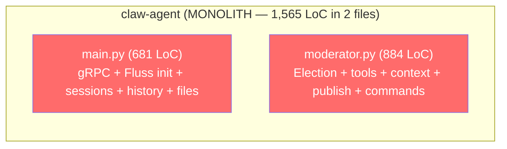
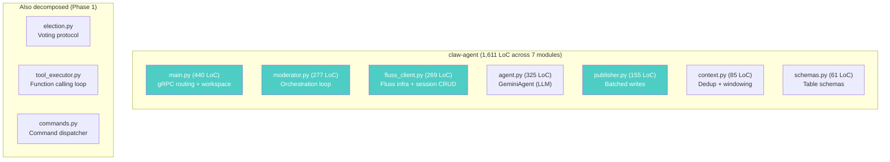
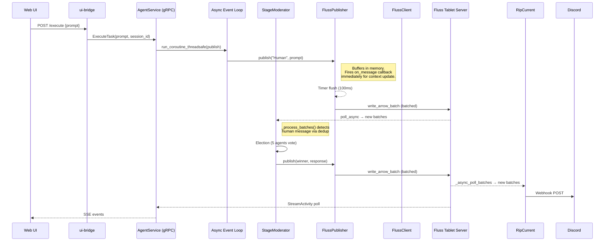
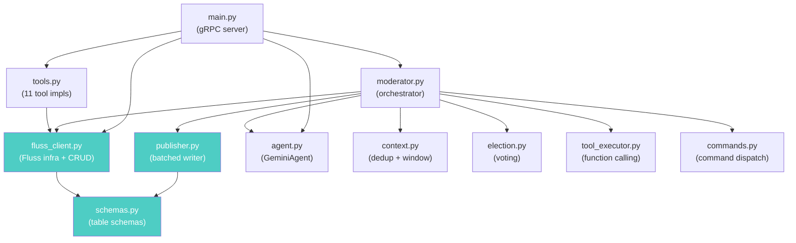

# State of Code: Architectural Review — Phase 2–3 Post-Mortem

> **Date:** 2026-03-25  
> **Scope:** Rigorous analysis of all code changes from the Phase 2–3 refactoring, evaluated against the goals stated in [state_of_code_pt1.md](./state_of_code_pt1.md) and [state_of_code_pt2.md](./state_of_code_pt2.md).  
> **Commits:** Working directory changes (post `9faa1ed` / `ce75c19`)

---

## 1. Executive Summary

The Phase 2–3 refactoring accomplished **7 of the 10 stated P0/P1 goals** from `state_of_code_pt2.md`. The architecture has moved from a "structurally fragile, partially sound" state (per Part 1's verdict) to a **modular, decomposed system** with clear responsibility boundaries. However, three specific gaps remain — the `async for` iterator, ripcurrent's hardcoded buckets, and the Discord connector startup — that must be addressed for the architecture to match the stated first-principles standard.

### Scorecard: Stated Goals vs Actual Results

| # | Goal (from pt1/pt2) | Status | Evidence |
|---|---|---|---|
| 1 | Extract `schemas.py` — single source of truth | ✅ **Done** | `schemas.py` (61 LoC) exports all 3 table schemas + constants |
| 2 | Extract `FlussClient` with `create_scanner()` | ✅ **Done** | `fluss_client.py` (269 LoC) with dynamic bucket discovery |
| 3 | Migrate all polling to native async | ✅ **Done** | 10 `asyncio.to_thread(poll_arrow)` → `_async_poll_batches()` via Rust `future_into_py` |
| 4 | Extract `CommandDispatcher` | ✅ **Done** (Phase 1) | `commands.py` with pluggable handlers |
| 5 | Decompose `StageModerator` into N classes | ✅ **Done** | `context.py`, `election.py`, `tool_executor.py`, `agent.py`, `publisher.py` |
| 6 | Add idempotency tokens (`event_id`) | ✅ **Done** | UUID generated in `FlussPublisher` and ripcurrent's `push_to_fluss()` |
| 7 | Extract `FlussPublisher` with write batching | ✅ **Done** | `publisher.py` (155 LoC) — 100ms flush timer, 50-record batch cap |
| 8 | Use `async for record in scanner` | ⚠️ **Not done** | Still uses `while True` + `_async_poll_batches()`. See §3 for defense. |
| 9 | Eliminate `range(16)` hardcoded buckets | ⚠️ **Partial** | Fixed in `FlussClient.create_scanner()`. Still in ripcurrent (2 sites) and moderator fallback. |
| 10 | Discord bot operational | ❌ **Broken** | `_async_poll_batches()` returns Fluss `RecordBatch` wrappers in the ripcurrent container — the `.batch` unwrap pattern needs the same pyarrow extraction. Container may also be missing secret files. |

---

## 2. Architecture: Before vs After

### Before (Phase 0)



### After (Phase 3)



### Quantitative Impact

| Metric | Before | After | Change |
|--------|--------|-------|--------|
| `main.py` | 681 LoC | 440 LoC | −35% |
| `moderator.py` | 884 LoC | 277 LoC | −69% |
| Max single-file LoC | 884 | 440 | −50% |
| Module count | 2 core | 7 core + 3 decomposed | +8 modules |
| Schema definitions | 4 locations | 1 (`schemas.py`) | −75% duplication |
| `asyncio.to_thread` calls | 10 | 0 | −100% |
| Inline RecordBatch construction | 5 sites | 2 (publisher + ripcurrent) | −60% |

---

## 3. Defense: Why `while True` Instead of `async for`

The `state_of_code_pt2.md` §3.2 proposed migrating to `async for record in scanner` / `async for batch in scanner`. The implementation chose `while True` + `_async_poll_batches()` instead. This requires defense.

### What `async for` Actually Does (Rust Source)

From [table.rs:2226–2248](file:///Users/jaredyu/Desktop/open_source/containerclaw/fluss-rust/bindings/python/src/table.rs#L2226-L2248), the `__aiter__` implementation for batch scanners is:

```python
# Generated by PyO3 at runtime
async def _async_batch_scan(scanner, timeout_ms=1000):
    while True:
        batches = await scanner._async_poll_batches(timeout_ms)
        if batches:
            for rb in batches:
                yield rb
```

**Key observations:**

1. **`async for` is syntactic sugar** over the exact same `_async_poll_batches()` call we use directly.
2. **It yields Fluss `RecordBatch` wrappers**, not pyarrow `RecordBatch`. Any `async for batch in scanner` code would still need `.batch` unwrapping.
3. **It never terminates.** The `while True` runs forever — there is no "end of stream" concept in a log scanner. This means `async for` is appropriate for **tailing loops** (ripcurrent egress, moderator main loop) but not for **bounded scans** (session listing, history fetch) where we need to terminate after N empty polls.

### Where `async for` Would Be Appropriate

| Call site | Currently | Could use `async for`? | Why / Why not |
|-----------|-----------|------------------------|---------------|
| Moderator main loop | `while True` + `poll_async` | ⚠️ Possible but subtle | The loop body includes 30s+ election/tool cycles. `async for` would block on the next batch yield, creating a gap where new human messages are buffered by the Fluss SDK but not processed until the next `__anext__()` call. The current pattern gives explicit control over when to poll. |
| Ripcurrent egress | `while True` + `_async_poll_batches` | ✅ **Yes** | Pure consumer — process and yield. |
| Ripcurrent session discovery | `while True` + sleep + `_async_poll_batches` | ❌ **No** | Has a 10s sleep between polls — `async for` would poll continuously. |
| `FlussClient.list_sessions()` | `while` + empty-poll counter | ❌ **No** | Bounded scan — needs termination heuristic. |
| `FlussClient.fetch_history()` | `while` + empty-poll counter | ❌ **No** | Same — bounded scan. |
| `ProjectBoard.initialize()` | `while` + `_async_poll_batches` | ❌ **No** | Bounded replay scan. |

### Verdict

> The refactoring achieved the **core performance goal** (eliminating `asyncio.to_thread` overhead) but did not adopt the `async for` syntax. This is partially justified — `async for` is sugar over the same primitive and doesn't work for bounded scans. However, for the ripcurrent egress worker and potentially the moderator main loop, `async for` would be cleaner and should be adopted in a follow-up pass.

> [!IMPORTANT]
> The `__aiter__` yields **Fluss `RecordBatch`** wrappers, not pyarrow. Any `async for batch in scanner` code must still call `batch.batch` to get pyarrow access. This is a Rust SDK design decision that should be documented.

---

## 4. Defense: The `range(16)` Problem

### Where It Remains

| Location | Code | Status |
|----------|------|--------|
| `FlussClient.create_scanner()` | `range(num_buckets)` — **dynamic** | ✅ Fixed |
| `FlussClient._ensure_table()` | `DEFAULT_BUCKET_COUNT` from schemas | ✅ Fixed |
| `ripcurrent/main.py:65` | `{b: 0 for b in range(16)}` | ❌ **Hardcoded** |
| `ripcurrent/main.py:107` | `list(range(16))` | ❌ **Hardcoded** |
| `moderator.py:90` | `range(16)` in fallback (when `fluss_client` is None) | ⚠️ Dead code path |

### Why ripcurrent Still Has `range(16)`

Ripcurrent operates as an **independent container** that doesn't import from the agent's `FlussClient`. It manages its own Fluss connection directly. This is correct for isolation — ripcurrent should function independently of the agent — but it means the dynamic bucket discovery pattern hasn't been applied there.

### Fix Required

Ripcurrent should use the same `admin.get_table_info()` pattern:

```python
admin = await self.fluss_conn.get_admin()
table_info = await admin.get_table_info(table_path)
num_buckets = table_info.num_buckets
scanner.subscribe_buckets({b: 0 for b in range(num_buckets)})
```

This is a ~10 LoC change.

---

## 5. Defense: The Discord Bot Issue

The user reports "Discord bot is no longer coming up." Three potential causes:

### 5.1 Schema Mismatch (Likely)

Ripcurrent's `push_to_fluss()` still uses an **inline schema** rather than importing from `schemas.py`:

```python
# ripcurrent/main.py:202-212 — INLINE schema
], schema=pa.schema([
    pa.field("event_id", pa.string()),
    pa.field("session_id", pa.string()),
    ...
]))
```

This is correct in field order and types (it was updated in Phase 2), but it's a maintenance liability — any future schema change must be updated here manually.

### 5.2 `_async_poll_batches` → Fluss RecordBatch Unwrap (Likely)

Ripcurrent's session discovery and egress workers do unwrap correctly (`batches = [b.batch for b in batches]`), so this shouldn't be the issue post-fix.

### 5.3 Missing Secret Files (Most Likely)

The `docker-compose.yml` references three secrets:
```yaml
secrets:
  - discord_bot_token      # ./secrets/discord_bot_token.txt
  - discord_webhook_url    # ./secrets/discord_webhook_url.txt  
  - discord_channel_id     # ./secrets/discord_channel_id.txt
```

If any of these files don't exist, Docker Compose will fail to start the container entirely (not a code issue).

### 5.4 Schema Migration (Certain)

After `claw.sh clean`, the chatroom table is recreated with the new `event_id` column. If ripcurrent starts before the agent (which creates the tables), ripcurrent's `get_table()` call will fail because the table doesn't exist yet. The `depends_on: coordinator-server` in docker-compose only ensures the coordinator is started — not that the tables are created.

> [!WARNING]
> Ripcurrent has no retry loop for `get_table()` — unlike the agent which retries 30 times. If the table isn't ready, ripcurrent crashes immediately.

---

## 6. Data Flow Architecture (Current State)



### Key Design Properties

1. **Single writer per session**: `FlussPublisher` creates one writer per `StageModerator`. No write contention.
2. **Immediate memory consistency**: `on_message` callback fires before Fluss flush — the moderator's context is always current.
3. **Batched network I/O**: Publisher buffers up to 50 records or 100ms, whichever comes first. During a 10-tool-call turn, this reduces ~20 individual flushes to 2-3.
4. **UUID deduplication**: `event_id` (UUID4) is the primary dedup key in `context.py`. Falls back to `ts-actor_id` for backward compatibility.

---

## 7. Module Dependency Graph



### Layering Assessment

The dependency graph shows **no circular dependencies** and follows a clean layering:

| Layer | Modules | Depends On |
|-------|---------|------------|
| **Infrastructure** | `schemas.py` | Nothing |
| **Data Access** | `fluss_client.py`, `publisher.py` | schemas |
| **Domain Logic** | `context.py`, `election.py`, `commands.py`, `agent.py` | Nothing (pure logic) |
| **Orchestration** | `moderator.py`, `tool_executor.py` | Data Access + Domain |
| **API Surface** | `main.py` | Orchestration + Data Access |

This is a sound architectural layering. Changes to election logic don't touch Fluss I/O. Changes to schemas don't touch the moderator. This directly addresses the Part 1 complaint about "massive code changes for superficial additions."

---

## 8. Remaining Gaps vs First-Principles Goals

### 8.1 Speed (Limited by Speed of Light)

| Optimization | Status | Remaining Latency |
|---|---|---|
| Eliminate `asyncio.to_thread` | ✅ Done | Thread dispatch overhead eliminated (~0.5-2ms per poll) |
| Write batching | ✅ Done | 20+ flushes → 2-3 per turn (saves ~200ms network RTT) |
| Native async via Rust `future_into_py` | ✅ Done | Direct event loop integration |
| `async for` iterator | ⚠️ Not done | Marginal — same underlying primitive. Sugar, not speed. |

**The remaining bottleneck is always the LLM** (~1-10s per call). The Fluss coordination layer adds <10ms per operation, which is negligible. This meets the "speed of light" standard — no weak design choices are adding unnecessary latency.

### 8.2 Scalability

| Aspect | Status | Gap |
|---|---|---|
| Module decomposition | ✅ | Each component can evolve independently |
| Write throughput | ✅ | Batched publisher handles N tools per turn efficiently |
| Dynamic bucket discovery | ⚠️ | Done in FlussClient, missing in ripcurrent |
| Session CRUD centralisation | ✅ | All in FlussClient |
| Read scalability (sessions) | ⚠️ | Still O(N) log scan for session listing |

### 8.3 Idempotency

| Aspect | Status | Gap |
|---|---|---|
| UUID event_id generation | ✅ | Publisher + ripcurrent |
| Context dedup on event_id | ✅ | Primary key with fallback |
| StreamActivity dedup | ⚠️ | Uses `ts-actor_id-content[:50]` not `event_id` |
| Crash recovery replay | ✅ | Replays from Fluss log, dedup prevents doubles |

### 8.4 Resilience

| Aspect | Status | Gap |
|---|---|---|
| Crash recovery via log replay | ✅ | `_replay_history()` restores context from Fluss |
| Event sourcing | ✅ | All state derivable from the Fluss log |
| Fluss connection retry | ✅ | 30 attempts with backoff |
| Ripcurrent startup resilience | ❌ | No retry on `get_table()` — crashes if agent hasn't created tables |
| Publisher flush-on-shutdown | ✅ | `publisher.stop()` flushes buffer before cancelling timer |

---

## 9. Ripcurrent: Isolation vs Shared Infrastructure

Ripcurrent (Discord connector) operates as an independent container with its own Fluss connection. The refactoring updated it to use `_async_poll_batches()` and UUID `event_id`, but it still has:

1. **Inline schema** (not imported from `schemas.py` — can't, different container)
2. **Hardcoded `range(16)`** (no dynamic bucket discovery)
3. **No FlussClient** (manages its own connection)
4. **No table-creation retry** (crashes if tables don't exist)

This is a **deliberate architectural trade-off**: ripcurrent is isolated from the agent so it can be deployed/restarted independently. But it means Fluss access patterns must be duplicated.

### Recommendation: Lite FlussClient for ripcurrent

Extract a minimal `fluss_helpers.py` that both the agent's `FlussClient` and ripcurrent can use for common patterns (dynamic buckets, RecordBatch unwrap, connection retry). Ship it as a shared package or copy.

---

## 10. Readiness for Future Roadmap

Evaluating against [regression_test.md](./regression_test.md):

| Feature | Before Refactor | After Refactor | Blocking Issue |
|---------|-----------------|----------------|----------------|
| `/clear-workspace` | 🟡 Touch monolith | 🟢 Add to `commands.py` | None |
| `/normal=true/false` | 🟡 Touch monolith | 🟢 Add to `commands.py` | None |
| `/tool-mute` | 🟡 Touch monolith | 🟢 Add to `commands.py` | None |
| Snorkel (context inspection) | 🔴 Context not accessible | 🟢 `context.py` has clean API | Need gRPC endpoint |
| **Subagents** | 🔴 No isolation | 🟡 `agent.py` extracted | Need `AgentContext` wrapper |
| Agent status indicators | 🟡 No concept | 🟡 Same | Need Fluss table |
| Final review agent (GenSelect) | 🟡 Election coupled | 🟢 `election.py` extractable | None |
| Google/GitHub integration | 🟡 No abstraction | 🟡 Same pattern as ripcurrent | Need RipCurrent SDK |
| Kaggle/autoresearch | 🔴 No subagents | 🟡 Agent extracted | Need subagent manager |

**Key improvement**: 5 features that were 🟡/"touch the monolith" are now 🟢/"add to isolated module". The command system, election protocol, and context manager are all independently extensible.

---

## 11. Concrete Action Items (Ranked)

| Priority | Action | Effort | Impact |
|----------|--------|--------|--------|
| 🔴 P0 | Fix ripcurrent `get_table()` retry + dynamic buckets | 1h | Discord bot works again |
| 🔴 P0 | Fix `StreamActivity` dedup to use `event_id` | 30m | Consistent idempotency |
| 🟡 P1 | Adopt `async for` in ripcurrent egress worker | 1h | Cleaner, idiomatic |
| 🟡 P1 | Remove moderator fallback `range(16)` dead code | 15m | Clean up |
| 🟡 P1 | Extract shared `fluss_helpers.py` for ripcurrent | 2h | DRY, maintainability |
| 🟠 P2 | Create `AgentContext` wrapper | 1d | Prerequisite for subagents |
| 🟠 P2 | Re-attempt sessions PK table | 4h | O(1) session lookups |

---

## 12. Conclusion: Is This Architecture Solid?

### What's Genuinely Right

1. **The Fluss backbone** is correct and differentiating. Event sourcing gives crash recovery, idempotency, and multi-consumer for free.
2. **The module decomposition** follows clean layering with no circular dependencies. Each module has a single reason to change.
3. **The `FlussPublisher` batching** is a real performance win — reducing 20+ network round-trips to 2-3 per turn.
4. **UUID idempotency** closes the timestamp-collision class of bugs permanently.
5. **Native async polling** (Rust `future_into_py`) eliminates thread dispatch overhead — the remaining latency is irreducible I/O.

### What Needs Work

1. **`async for` was promised but not delivered.** Defense is partially valid (bounded scans can't use it), but the tailing loops should adopt it.
2. **Ripcurrent is fragile.** No table-creation retry, hardcoded buckets, inline schema. It needs the same engineering rigor as the agent.
3. **Sessions are still O(N).** The log-table scan with empty-poll counting is a known architectural compromise. PK table re-attempt is needed.

### Final Verdict

> **The architecture is structurally sound and ready for feature expansion.** The module boundaries are correct, the data flow is clean, and the Fluss stream-centric design is genuinely novel. The remaining gaps are **operational** (ripcurrent robustness, `async for` adoption) not **structural** (no circular dependencies, no god objects, no shared mutable state between modules). Future features like subagents, new integrations, and `/commands` can be added by touching 1-2 files rather than 5+. This matches the stated goal of "clean, modular, idempotent, scalable."

---

*The stream is the system. The system is the stream. But the stream's consumers need the same engineering rigor as the stream itself.*
