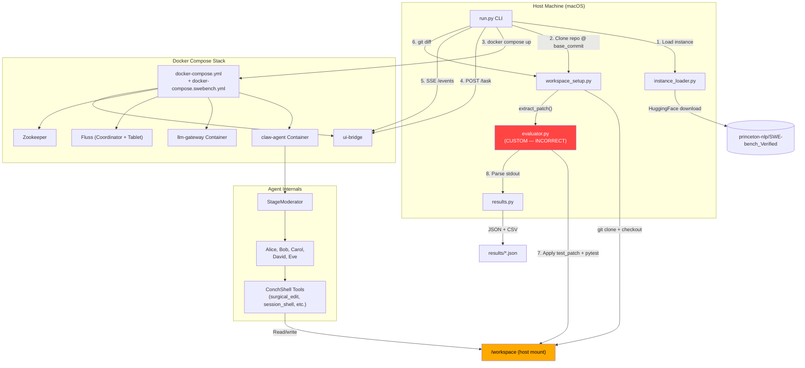
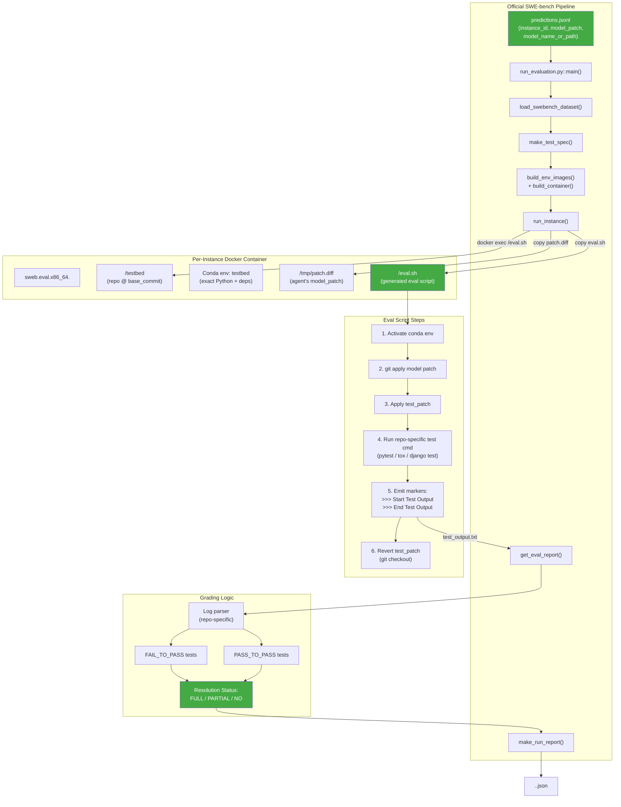
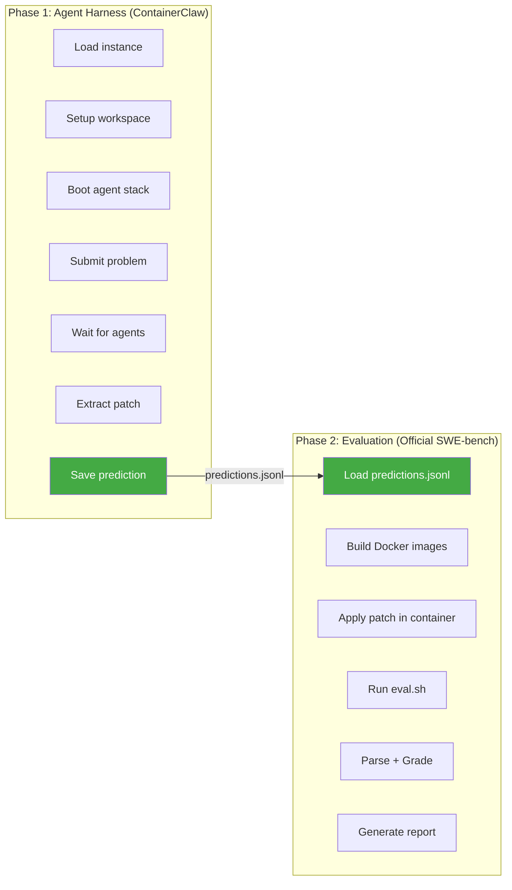
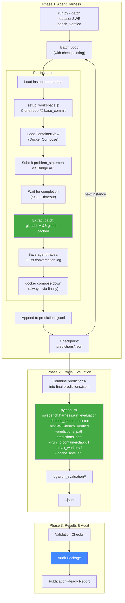
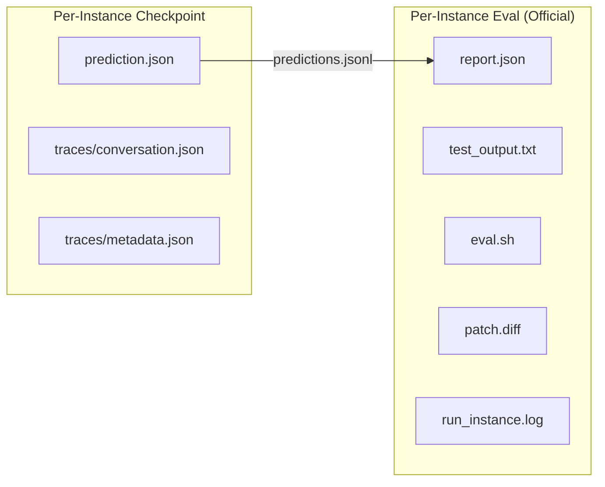

# SWE-bench Verified: Comprehensive E2E Benchmarking Audit

> **Purpose**: Rigorous architectural review of ContainerClaw's SWE-bench Verified integration.
> Examines the current harness, identifies correctness gaps vs. the official SWE-bench evaluator,
> and proposes a fully auditable pipeline suitable for published research.
>
> **Date**: 2026-04-08
> **Scope**: `scripts/swe_bench/*`, `docker-compose.swebench.yml`, `agent/`, official `SWE-bench/` repo

---

## Table of Contents

1. [Executive Summary](#1-executive-summary)
2. [Architecture Overview — Current State](#2-architecture-overview--current-state)
3. [Architecture Overview — Official SWE-bench Harness](#3-architecture-overview--official-swe-bench-harness)
4. [Gap Analysis: What's Wrong and Why](#4-gap-analysis-whats-wrong-and-why)
5. [The Two Fundamental Problems](#5-the-two-fundamental-problems)
6. [Proposed Architecture: Correct E2E Pipeline](#6-proposed-architecture-correct-e2e-pipeline)
7. [Detailed Code Changes Required](#7-detailed-code-changes-required)
8. [Auditing & Reproducibility Requirements](#8-auditing--reproducibility-requirements)
9. [Validation Strategy](#9-validation-strategy)
10. [Execution Plan](#10-execution-plan)

---

## 1. Executive Summary

**Your suspicion is correct on both counts.**

| Area | Verdict | Severity |
|------|---------|----------|
| ContainerClaw harness readiness | ❌ Not production-ready | **Critical** |
| SWE-bench testing loop correctness | ❌ Fundamentally wrong | **Critical** |

### Why?

The current pipeline (`scripts/swe_bench/run.py`) implements a **custom evaluator** (`evaluator.py`) that attempts to grade agent patches by running pytest on the host. This is **incompatible** with how SWE-bench Verified results are validated in practice. The official SWE-bench harness:

1. Builds per-instance **Docker images** with the exact environment (Python version, conda env, pip deps) specified per `(repo, version)` pair
2. Applies the agent patch **inside** the container at `/testbed`
3. Runs a **generated eval script** (not raw pytest) that includes test-patch application, environment activation, and repo-specific test commands
4. Grades results by parsing structured test output markers (`>>> Start Test Output` / `>>> End Test Output`) against known `FAIL_TO_PASS` and `PASS_TO_PASS` test-case lists

The current ContainerClaw harness does **none** of these. It runs a naive `pytest -xvs` on the host filesystem and parses stdout with regex — a fundamentally different evaluation methodology that would not be accepted for publication.

### What Your POC Notebook Proves

The notebook `swe_bench_verified.ipynb` is actually the **correct approach** — it calls the official `swebench.harness.run_evaluation` with a `predictions.jsonl` file. The gold-patch sanity test (`django__django-11133`) passed (1/1 resolved). This validates that:
- Your Docker image setup for `x86_64` works (via Rosetta on Apple Silicon)
- The official harness library is correctly installed
- The evaluation contract (JSONL with `instance_id`, `model_patch`, `model_name_or_path`) is sound

**The notebook is the seed of the correct solution. The `scripts/swe_bench/` harness needs to be restructured to produce JSONL predictions and delegate grading to the official harness.**

---

## 2. Architecture Overview — Current State



### Current Data Flow — Step by Step

| Step | Component | Action | Issue? |
|------|-----------|--------|--------|
| 1 | `instance_loader.py` | Downloads `princeton-nlp/SWE-bench_Verified` from HuggingFace, caches as JSON | ⚠️ Default dataset is `SWE-bench_Lite`, not `Verified` |
| 2 | `workspace_setup.py` | Clones target repo, checks out `base_commit` into `./workspace` | ⚠️ `--depth 1` fetch lacks commit ancestry for `git apply` |
| 3 | `run.py` | Boots full ContainerClaw stack (agent + gateway + Fluss + ZK + bridge + UI) | ⚠️ 7+ containers for benchmark is fragile overkill |
| 4 | `run.py` | POSTs `problem_statement` to bridge → agent via gRPC | ✅ Correct |
| 5 | `run.py` | Polls SSE stream for `finish` event with timeout | ⚠️ No guarantee agent emits `finish` |
| 6 | `workspace_setup.py` | Extracts `git diff` from workspace | ⚠️ Misses untracked new files |
| 7 | `evaluator.py` | Applies `test_patch` via `git apply`, runs `pytest -xvs` on host | ❌ **Wrong methodology** |
| 8 | `results.py` | Saves per-instance JSON, generates CSV + summary | ⚠️ Schema doesn't match official format |

---

## 3. Architecture Overview — Official SWE-bench Harness



### The Official Evaluation Contract

The official harness requires exactly one input: a **JSONL file** (one entry per line) with three fields:

```json
{
  "instance_id": "django__django-11133",
  "model_patch": "diff --git a/django/http/response.py b/django/http/response.py\n--- ...",
  "model_name_or_path": "containerclaw-v1"
}
```

The harness then:

1. **Builds a per-instance Docker image** (`sweb.eval.x86_64.<instance_id>`) with:
   - The exact OS, Python version, conda packages, and pip deps for that `(repo, version)`
   - The repo cloned at `base_commit` into `/testbed`
2. **Generates and runs `eval.sh`** inside the container, which:
   - Activates the conda `testbed` env
   - Applies the agent's `model_patch` via `git apply --verbose` (with reject/patch fallbacks)
   - Applies the `test_patch` (the gold test additions)
   - Runs the repo-specific test command (e.g., `python -m pytest tests/...` for django)
   - Emits structured markers around test output
   - Reverts the test patch
3. **Grades** by parsing the test output logged between `>>> Start Test Output` and `>>> End Test Output` using a **repo-specific log parser** (not generic regex), then checking:
   - **FAIL_TO_PASS**: All tests that should now pass (because the bug was fixed) → must ALL pass
   - **PASS_TO_PASS**: All tests that were passing before → must ALL still pass (regression check)
   - **Resolution**: `FULL` iff F2P = 100% AND P2P = 100%

### Why This Matters

| Aspect | Custom Evaluator | Official Harness |
|--------|-----------------|-----------------|
| Environment | Host Python (whatever is installed) | Exact conda env per `(repo, version)` |
| Dependency install | `pip install -e .` (maybe) | Full conda setup + pip per spec |
| Test runner | `pytest -xvs` (generic) | Repo-specific (pytest/tox/django test) |
| Test selection | Extract from `test_patch` diff filenames | Structured `FAIL_TO_PASS` + `PASS_TO_PASS` lists |
| Output parsing | Regex on pytest summary line | Repo-specific log parser with structured markers |
| Grading criteria | `failed == 0 and total > 0` | `F2P == 100% AND P2P == 100%` |
| Isolation | Shared host workspace | Per-instance Docker container |
| Reproducibility | Non-deterministic (host state leaks) | Deterministic (Docker image pinned) |

**No reviewer or leaderboard will accept results from the custom evaluator.**

---

## 4. Gap Analysis: What's Wrong and Why

### 4.1 Critical Issues

#### C1: Custom Evaluator is Scientifically Invalid

**File**: `scripts/swe_bench/evaluator.py`

The entire `evaluate_patch()` function is architecturally wrong. It:

- Runs pytest on the **host filesystem**, not inside a controlled Docker environment
- Uses `sys.executable` (the host Python), which may not match the repo's required Python version
- Naively applies `test_patch` via `git apply` without the conda environment, pre-install hooks, or repo-specific setup
- Parses pytest output with a simplistic regex (`(\d+) passed`) that:
  - Cannot distinguish between `FAIL_TO_PASS` and `PASS_TO_PASS` cohorts
  - Cannot handle Django's custom test runner output
  - Cannot handle xfail, skip, or error states correctly
- Uses `resolved = (failed == 0 and total > 0)` which would falsely report resolution if unrelated tests happen to pass

**Impact**: Results from this evaluator are **not comparable** to any published SWE-bench results. A paper using these results would be rejected on methodology grounds.

#### C2: Dataset Default is Wrong

**File**: `scripts/swe_bench/instance_loader.py`, line 18, 43, 74, 88

```python
def load_dataset_cached(dataset_name: str = "princeton-nlp/SWE-bench_Lite", ...)
```

The default is `SWE-bench_Lite` (300 instances) but we want `SWE-bench_Verified` (500 instances). The `run.py` CLI also defaults to `SWE-bench_Lite`:

```python
parser.add_argument("--dataset", default="princeton-nlp/SWE-bench_Lite", ...)
```

These are **different benchmarks** with different instance sets. SWE-bench Verified is the gold standard for publications.

#### C3: Workspace Isolation is Broken

**File**: `workspace_setup.py`

All instances share a **single `/workspace` directory** on the host. The `setup_workspace()` function does `shutil.rmtree(workspace)` between instances, but:

1. The running ContainerClaw Docker stack **mounts this same workspace** — rmtree while containers are running causes race conditions
2. Agent state in `.conchshell/` is backed up/restored, but this leaks context between instances
3. The `--depth 1` clone creates a repository with **no commit history**, which can break `git apply` for patches that reference parent commits

#### C4: Patch Extraction Misses New Files

**File**: `workspace_setup.py`, `extract_patch()`

```python
def extract_patch(workspace_dir: str = "./workspace") -> str:
    result = subprocess.run(["git", "diff"], ...)
    patch = result.stdout
    if not patch:
        result = subprocess.run(["git", "diff", "--cached"], ...)
```

This **only captures modifications to tracked files**. If the agent creates a new file (via `create_file` tool), `git diff` won't see it because the file is untracked. Need:

```python
# Correct: stage everything, then diff
subprocess.run(["git", "add", "-A"], ...)
subprocess.run(["git", "diff", "--cached"], ...)
```

#### C5: Agent Completion Detection is Unreliable

**File**: `run.py`, `wait_for_completion()`

The function polls the SSE stream for a `"finish"` event. However:

- The agent may never emit a `finish` event (hangs, crashes, infinite tool loops)
- The `max_tool_rounds` (30) is not sufficient for complex instances
- There is no correlation between SSE events and the actual agent state machine (`ReconciliationController`)
- Timeout handling just `break`s from the loop — it doesn't signal the agent to stop or save state

#### C6: Docker Stack Overhead

The SWE-bench override (`docker-compose.swebench.yml`) boots the **entire** ContainerClaw stack:

- `claw-agent` — the multi-agent system
- `llm-gateway` — API proxy
- `coordinator-server` — Fluss coordinator
- `tablet-server` — Fluss storage
- `zookeeper` — coordination
- `ui-bridge` — Flask bridge
- `ui` — React frontend
- `ripcurrent-discord` — Discord bot

That's **8+ containers** per instance. For 500 instances, this is:
- ~3 minutes to boot per instance (health check start_period = 60s)
- ~25 hours just in boot/teardown overhead at 3 min × 500
- High probability of Docker daemon instability over multi-day runs

### 4.2 Non-Critical but Important Issues

| ID | Issue | File | Description |
|----|-------|------|-------------|
| N1 | Missing `requests` dependency | `scripts/swe_bench/requirements.txt` | Contains `datasets` and `tabulate` but not `requests` — the existing result `django__django-10914.json` shows `"error": "No module named 'requests'"` |
| N2 | No run-level metadata | `results.py` | Doesn't record: model name, model version, LLM provider, temperature, max_tokens, config hash, git commit of ContainerClaw itself |
| N3 | No agent trace logging | `run.py` | The full ConchShell conversation (election votes, tool calls, agent thoughts) is not saved per instance |
| N4 | No seed/determinism control | Multiple | No random seed pinning for LLM sampling, no workspace hash verification |
| N5 | No cost tracking | `run.py` | Token usage, API costs, and LLM call counts are not recorded per instance |
| N6 | CSV schema mismatch | `results.py` | The CSV doesn't include columns needed for leaderboard submission |
| N7 | Summaries compute averages wrong | `results.py` | Errored instances with 0 values for patch_size/turns/wall_clock pull averages down |

---

## 5. The Two Fundamental Problems

### Problem 1: Two-Phase Pipeline Mismatch

The current pipeline tries to be **both** the agent harness **and** the evaluator. These should be separate concerns:



**Currently, Phase 1 and Phase 2 are conflated.** The `run_single()` function tries to do both in one loop, using a custom evaluator instead of the official one. The predictions.jsonl file — the **interface contract** between the two phases — does not exist in the current pipeline.

### Problem 2: The Evaluator Cannot Run on the Host

The official SWE-bench eval requires:
- Docker containers with specific base images (Ubuntu 22.04 x86_64)
- Conda environments with pinned Python versions (3.6 - 3.12 depending on repo/version)
- Repo-specific test commands (not just `pytest`)
- Repo-specific log parsers (different repos have different test output formats)

Running `pytest` on macOS with whatever Python is installed will produce **different results** than the official eval. Even on the same code, the test outcomes can differ because:
- Django tests use their own test runner, not pytest
- Matplotlib tests require specific backend configurations
- SymPy tests have known timeouts at specific Python versions
- Scikit-learn tests require specific NumPy/SciPy versions

---

## 6. Proposed Architecture: Correct E2E Pipeline



### Key Architectural Decisions

#### D1: Strict Phase Separation
Phase 1 (agent harness) **only** produces `predictions.jsonl`. It does **not** grade results. Phase 2 uses the unmodified official SWE-bench harness to evaluate. This ensures:
- Results are directly comparable to other systems on the leaderboard
- No reviewer can question the evaluation methodology
- The agent harness and evaluator are independently testable

#### D2: Per-Instance Prediction Checkpointing
Each instance's prediction is saved as an individual JSON file under `predictions/<instance_id>.json`. This enables:
- Resumable batch runs (skip completed instances)
- Incremental evaluation (run Phase 2 on partial results)
- Easy auditing (one file per instance)

A final `combine_predictions.py` script merges these into the single `predictions.jsonl` required by the official harness.

#### D3: Agent Trace Archival
For each instance, the full agent conversation log (from Fluss) is extracted and saved alongside the prediction. This captures:
- Every election vote and winner
- Every tool call with arguments and results
- Every agent thought and reflection
- Wall clock time per phase

This is critical for:
- Debugging false negatives (the agent had the right idea but the tool execution failed)
- Ablation studies (which agent contributed most?)
- Reproducibility analysis (did the same instance produce different patches on re-runs?)

#### D4: Workspace Git Hygiene
The `extract_patch()` function must produce a **complete, clean unified diff** that includes:
- Modified tracked files
- New untracked files
- Deleted files

This requires staging all changes first:
```bash
git add -A
git diff --cached HEAD
```

---

## 7. Detailed Code Changes Required

### 7.1 `scripts/swe_bench/run.py` — Major Restructure

```mermaid
flowchart TB
    subgraph "Current run_single()"
        C1["1. load_instance()"] --> C2["2. setup_workspace()"]
        C2 --> C3["3. docker compose up"]
        C3 --> C4["4. submit_task()"]
        C4 --> C5["5. wait_for_completion()"]
        C5 --> C6["6. extract_patch()"]
        C6 --> C7["7. evaluate_patch() ❌"]
        C7 --> C8["8. save_result()"]
    end
    
    subgraph "Corrected run_single()"
        N1["1. load_instance()"] --> N2["2. setup_workspace()"]
        N2 --> N3["3. docker compose up"]
        N3 --> N4["4. submit_task()"]
        N4 --> N5["5. wait_for_completion()"]
        N5 --> N6["6. extract_patch()<br/>(git add -A + diff --cached)"]
        N6 --> N7["7. save_prediction()<br/>(JSONL format)"]
        N7 --> N8["8. archive_agent_traces()"]
    end
    
    style C7 fill:#ff4444,color:#fff
    style N7 fill:#44aa44,color:#fff
    style N8 fill:#4488ff,color:#fff
```



**Changes in `run_single()`:**

1. **Remove** the `evaluate_patch()` call (step 7) entirely
2. **Replace** `save_result()` with `save_prediction()` that writes the official JSONL prediction format
3. **Add** `archive_agent_traces()` to dump the Fluss conversation log
4. **Add** run-level metadata capture (model config, ContainerClaw git commit, timestamps)
5. **Fix** `extract_patch()` to use `git add -A && git diff --cached`
6. **Fix** `wait_for_completion()` to have a hard kill mechanism and state dump on timeout

**Changes in `main()` (batch mode):**

1. **Change** default dataset to `princeton-nlp/SWE-bench_Verified`
2. **Add** `--model-name` argument (required) for the `model_name_or_path` field
3. **Add** `--predictions-dir` argument for checkpoint directory
4. **Add** post-batch evaluation step that calls the official harness
5. **Remove** `generate_summary()` (replaced by official `make_run_report()`)

### 7.2 `scripts/swe_bench/evaluator.py` — Delete or Demote

**Recommendation: Delete this file.**

It provides a false sense of correctness. If kept as a "quick-check" utility, rename to `quick_check.py` and add a prominent warning:

```python
"""
⚠️ WARNING: This is NOT the official SWE-bench evaluator.
Results from this script are NOT valid for publication or leaderboard submission.
Use `python -m swebench.harness.run_evaluation` for official results.
"""
```

### 7.3 `scripts/swe_bench/workspace_setup.py` — Fix `extract_patch()`

**Current** (Broken):
```python
def extract_patch(workspace_dir: str = "./workspace") -> str:
    result = subprocess.run(["git", "diff"], ...)
    patch = result.stdout
    if not patch:
        result = subprocess.run(["git", "diff", "--cached"], ...)
```

**Corrected**:
```python
def extract_patch(workspace_dir: str = "./workspace") -> str:
    workspace = Path(workspace_dir).resolve()
    
    # Stage ALL changes (tracked modifications + new files + deletions)
    subprocess.run(["git", "add", "-A"], cwd=str(workspace), capture_output=True, timeout=30)
    
    # Diff staged changes against HEAD
    result = subprocess.run(
        ["git", "diff", "--cached", "HEAD"],
        capture_output=True, text=True, cwd=str(workspace), timeout=30,
    )
    return result.stdout

    # NOTE: We intentionally leave changes staged.
    # The workspace is destroyed per-instance anyway.
```

### 7.4 `scripts/swe_bench/instance_loader.py` — Fix Default Dataset

```python
# Change default in all functions:
def load_dataset_cached(dataset_name: str = "princeton-nlp/SWE-bench_Verified", ...)
def load_instance(instance_id: str, dataset_name: str = "princeton-nlp/SWE-bench_Verified")
def list_instances(dataset_name: str = "princeton-nlp/SWE-bench_Verified", ...)
```

### 7.5 New File: `scripts/swe_bench/prediction_writer.py`

```python
"""
Prediction Writer — Interface to the official SWE-bench evaluation contract.

Produces per-instance prediction checkpoints and combines them into
the final predictions.jsonl file required by the official harness.
"""

import json
from pathlib import Path
from datetime import datetime, timezone


def save_prediction(instance_id: str, model_patch: str,
                    model_name: str, predictions_dir: str,
                    metadata: dict = None) -> Path:
    """Save a single prediction as a checkpoint file.
    
    Format matches the official SWE-bench prediction schema:
        instance_id, model_patch, model_name_or_path
    """
    out = Path(predictions_dir)
    out.mkdir(parents=True, exist_ok=True)
    
    prediction = {
        "instance_id": instance_id,
        "model_patch": model_patch,
        "model_name_or_path": model_name,
    }
    
    # Save checkpoint with extra metadata (not sent to evaluator)
    checkpoint = {
        **prediction,
        "saved_at": datetime.now(timezone.utc).isoformat(),
        **(metadata or {}),
    }
    
    checkpoint_file = out / f"{instance_id.replace('/', '_')}.json"
    checkpoint_file.write_text(json.dumps(checkpoint, indent=2))
    return checkpoint_file


def combine_predictions(predictions_dir: str, output_path: str) -> int:
    """Combine per-instance checkpoints into a single predictions.jsonl.
    
    Only includes the three fields required by the official harness.
    Returns the number of predictions combined.
    """
    pred_dir = Path(predictions_dir)
    out_path = Path(output_path)
    
    count = 0
    with open(out_path, "w") as f:
        for checkpoint_file in sorted(pred_dir.glob("*.json")):
            checkpoint = json.loads(checkpoint_file.read_text())
            # Write ONLY the official fields
            prediction = {
                "instance_id": checkpoint["instance_id"],
                "model_patch": checkpoint["model_patch"],
                "model_name_or_path": checkpoint["model_name_or_path"],
            }
            f.write(json.dumps(prediction) + "\n")
            count += 1
    
    return count
```

### 7.6 New File: `scripts/swe_bench/trace_archiver.py`

```python
"""
Agent Trace Archiver — Captures the full ConchShell agent conversation
for auditing and ablation studies.
"""

import json
import time
from pathlib import Path
from datetime import datetime, timezone


def archive_traces(session_id: str, bridge_url: str,
                   instance_id: str, output_dir: str) -> Path:
    """Dump the full agent conversation from the bridge/Fluss.
    
    Captures:
        - All agent messages (thoughts, tool calls, tool results)
        - Election votes and winners
        - ConchShell tool execution details
        - Timing metadata
    """
    import requests
    
    archive_dir = Path(output_dir) / "traces" / instance_id.replace("/", "_")
    archive_dir.mkdir(parents=True, exist_ok=True)
    
    # Fetch conversation history from bridge
    try:
        resp = requests.get(f"{bridge_url}/history/{session_id}", timeout=30)
        if resp.status_code == 200:
            history = resp.json()
            trace_file = archive_dir / "conversation.json"
            trace_file.write_text(json.dumps(history, indent=2))
    except Exception as e:
        error_file = archive_dir / "trace_error.txt"
        error_file.write_text(f"Failed to fetch traces: {e}")
    
    # Save timing metadata
    meta_file = archive_dir / "metadata.json"
    meta_file.write_text(json.dumps({
        "instance_id": instance_id,
        "session_id": session_id,
        "archived_at": datetime.now(timezone.utc).isoformat(),
    }, indent=2))
    
    return archive_dir
```

### 7.7 New File: `scripts/swe_bench/evaluate.py` — Official Evaluation Wrapper

```python
"""
Official SWE-bench Evaluation Wrapper.

This script is a thin wrapper around the official `swebench.harness.run_evaluation`
module. It exists to:
    1. Ensure the correct dataset and run_id are used
    2. Validate predictions before submitting to the harness
    3. Capture and archive the full evaluation log
"""

import argparse
import json
import subprocess
import sys
from pathlib import Path

def validate_predictions(predictions_path: str, dataset_name: str) -> bool:
    """Validate prediction file format before running evaluation."""
    predictions = []
    with open(predictions_path) as f:
        for i, line in enumerate(f):
            try:
                pred = json.loads(line)
            except json.JSONDecodeError:
                print(f"❌ Line {i+1}: Invalid JSON")
                return False
            
            required_keys = {"instance_id", "model_patch", "model_name_or_path"}
            missing = required_keys - set(pred.keys())
            if missing:
                print(f"❌ Line {i+1}: Missing keys: {missing}")
                return False
            predictions.append(pred)
    
    # Check for empty patches
    empty = sum(1 for p in predictions if not p["model_patch"])
    print(f"📊 Valid predictions: {len(predictions)} total, {empty} empty patches")
    return True


def run_official_evaluation(
    predictions_path: str,
    dataset_name: str = "princeton-nlp/SWE-bench_Verified",
    run_id: str = "containerclaw-v1",
    max_workers: int = 1,
    cache_level: str = "env",
    timeout: int = 1800,
):
    """Run the official SWE-bench evaluation harness."""
    
    if not validate_predictions(predictions_path, dataset_name):
        print("❌ Prediction validation failed. Aborting evaluation.")
        sys.exit(1)
    
    cmd = [
        sys.executable, "-m", "swebench.harness.run_evaluation",
        "--dataset_name", dataset_name,
        "--predictions_path", predictions_path,
        "--run_id", run_id,
        "--max_workers", str(max_workers),
        "--cache_level", cache_level,
        "--timeout", str(timeout),
    ]
    
    print(f"🚀 Running official SWE-bench evaluation...")
    print(f"   Command: {' '.join(cmd)}")
    
    result = subprocess.run(cmd, text=True)
    
    if result.returncode != 0:
        print(f"❌ Evaluation failed with return code {result.returncode}")
        sys.exit(result.returncode)
    
    print("✅ Evaluation completed successfully.")


if __name__ == "__main__":
    parser = argparse.ArgumentParser(
        description="Run official SWE-bench evaluation on ContainerClaw predictions"
    )
    parser.add_argument("--predictions", required=True, help="Path to predictions.jsonl")
    parser.add_argument("--dataset", default="princeton-nlp/SWE-bench_Verified")
    parser.add_argument("--run-id", default="containerclaw-v1")
    parser.add_argument("--max-workers", type=int, default=1)
    parser.add_argument("--cache-level", default="env",
                        choices=["none", "base", "env", "instance"])
    parser.add_argument("--timeout", type=int, default=1800)
    args = parser.parse_args()
    
    run_official_evaluation(
        args.predictions, args.dataset, args.run_id,
        args.max_workers, args.cache_level, args.timeout,
    )
```

### 7.8 `docker-compose.swebench.yml` — Fix Agent Environment

**Current issues:**
- `pip install --break-system-packages -e /workspace` is wrong — each instance has different deps
- `HOME=/tmp` may interfere with git config
- No mechanism to cleanly signal agent stop

**Improved:**
```yaml
services:
  claw-agent:
    user: root
    environment:
      - AUTONOMOUS_STEPS=-1
      - CONCHSHELL_ENABLED=true
      - SWE_BENCH_MODE=true
      - HOME=/root
    volumes:
      - ${SWE_BENCH_WORKSPACE:-./workspace}:/workspace:rw
    command: >
      sh -c "python src/main.py"
    # NOTE: Dependency installation moved to workspace_setup.py 
    # where it can be repo-version specific. The compose override
    # should NOT install deps — different instances need different deps.
```

---

## 8. Auditing & Reproducibility Requirements

For a published research paper, the following must be captured, archived, and verifiable:

### 8.1 Run-Level Artifacts

| Artifact | Path | Contents |
|----------|------|----------|
| Run manifest | `runs/<run_id>/manifest.json` | Start/end time, ContainerClaw git SHA, config.yaml hash, dataset name, total instances, model info |
| Predictions | `runs/<run_id>/predictions/` | Per-instance JSONL checkpoint files |
| Combined predictions | `runs/<run_id>/predictions.jsonl` | Final combined file sent to evaluator |
| Agent traces | `runs/<run_id>/traces/<instance_id>/` | Full conversation JSON per instance |
| Evaluation logs | `logs/run_evaluation/<run_id>/` | Official harness logs (test_output.txt, report.json, eval.sh per instance) |
| Final report | `runs/<run_id>/<model>.<run_id>.json` | Official SWE-bench report |
| Environment snapshot | `runs/<run_id>/environment.json` | Docker version, Python version, `pip freeze` output, OS info |

### 8.2 Per-Instance Artifacts



### 8.3 Reproducibility Checklist

For the paper appendix, all of the following must be true:

| # | Requirement | Why |
|---|-------------|-----|
| 1 | ContainerClaw git commit is pinned | Reviewers can checkout the exact code |
| 2 | `config.yaml` is archived in the run bundle | Agent roster, tools, model parameters are recorded |
| 3 | LLM API version/model is recorded | Cloud API behavior changes over time |
| 4 | Docker image SHAs are logged | Ensures eval environment is identical |
| 5 | `predictions.jsonl` is the sole interface to the evaluator | No custom eval code in the path |
| 6 | All 500 instances are attempted (or failure is documented) | No cherry-picking |
| 7 | Empty patches are explicitly counted | Distinguishes "tried and failed" from "never attempted" |
| 8 | Total cost (tokens × price) is reported | Required by many venues |
| 9 | Wall-clock time per instance is recorded | Enables efficiency comparisons |
| 10 | Multiple runs existence | Statistical significance requires ≥2 runs (ideally 3) |

### 8.4 Cost Estimation

Rough estimate for a full SWE-bench Verified run (500 instances):

| Component | Estimate | Notes |
|-----------|----------|-------|
| Agent execution | ~10 min/instance × 500 = ~83 hours | Multi-agent with tool loops |
| Docker boot/teardown | ~3 min/instance × 500 = ~25 hours | Full stack up/down |
| Official eval | ~5 min/instance × 500 = ~42 hours | Docker image build + test run |
| **Total wall-clock** | **~150 hours (6.25 days)** | **Serial execution with max_workers=1** |
| LLM tokens (local MLX) | ~$0 (local inference) | Assuming MLX model on M-series Mac |
| LLM tokens (Gemini Cloud) | ~$50-200 | Depends on input/output token counts |
| LLM tokens (OpenAI gpt-4o) | ~$500-2000 | Significantly more expensive |

> **Speed-of-light analysis**: The theoretical minimum is bounded by Docker image build time (~2 min/instance for cache miss) + test execution time (~1-3 min/instance). Even with infinite parallelism and zero agent time, Phase 2 alone would take ~25+ hours for 500 instances at max_workers=1. This is a fundamental constraint of the SWE-bench evaluation methodology — each instance requires a fresh Docker container with its own conda environment.

---

## 9. Validation Strategy

### 9.1 Gold-Patch Sanity Test (Already Proven)

You've already done this in the notebook with `django__django-11133`. Extend to a broader set:

```bash
# Create gold predictions for 5 diverse repos
python scripts/swe_bench/create_gold_predictions.py \
    --dataset princeton-nlp/SWE-bench_Verified \
    --sample 5 \
    --output gold_predictions.jsonl

# Run official evaluation — expect 100% resolve rate
python -m swebench.harness.run_evaluation \
    --dataset_name princeton-nlp/SWE-bench_Verified \
    --predictions_path gold_predictions.jsonl \
    --run_id gold_sanity_check \
    --max_workers 1 \
    --cache_level env
```

**Expected result**: All 5 should resolve (`"resolved": true`). If any fail, the evaluation environment has issues that must be debugged before running ContainerClaw.

### 9.2 Empty-Patch Baseline

Create a predictions file with all empty patches. The official evaluator should report 0 resolved:

```bash
python -c "
import json
from datasets import load_dataset
ds = load_dataset('princeton-nlp/SWE-bench_Verified', split='test')
with open('empty_predictions.jsonl', 'w') as f:
    for row in ds:
        f.write(json.dumps({
            'instance_id': row['instance_id'],
            'model_patch': '',
            'model_name_or_path': 'empty_baseline'
        }) + '\n')
"
```

**Expected result**: 0 resolved, 500 empty patches. This validates the evaluator correctly handles the null case.

### 9.3 Single-Instance E2E Test

Run ContainerClaw on a single known instance, then evaluate:

```bash
# Phase 1: Agent harness
python scripts/swe_bench/run.py \
    --instance django__django-11133 \
    --dataset princeton-nlp/SWE-bench_Verified \
    --model-name containerclaw-test \
    --timeout 600 \
    --predictions-dir runs/test/predictions/

# Combine predictions
python scripts/swe_bench/prediction_writer.py \
    --combine runs/test/predictions/ \
    --output runs/test/predictions.jsonl

# Phase 2: Official evaluation
python scripts/swe_bench/evaluate.py \
    --predictions runs/test/predictions.jsonl \
    --run-id containerclaw-test \
    --max-workers 1
```

### 9.4 Batch Smoke Test (5 instances)

```bash
python scripts/swe_bench/run.py \
    --batch --limit 5 \
    --dataset princeton-nlp/SWE-bench_Verified \
    --model-name containerclaw-v1 \
    --timeout 600 \
    --predictions-dir runs/smoke/predictions/
```

Verify:
- Checkpointing works (interrupt and resume)
- Docker cleanup happens on all exit paths
- Each instance gets a fresh workspace
- predictions.jsonl contains exactly 5 entries

---

## 10. Execution Plan

### Phase 0: Prerequisites (< 1 hour)
- [ ] Install `swebench` package in the project venv (`pip install swebench`)
- [ ] Install `requests` in `scripts/swe_bench/requirements.txt`
- [ ] Verify Docker can build/run `x86_64` images (Rosetta on Apple Silicon)
- [ ] Pull base SWE-bench Docker images: `docker pull swebench/sweb.base.py.x86_64:latest`

### Phase 1: Fix Agent Harness (~ 4 hours)
- [ ] Fix `extract_patch()` — use `git add -A && git diff --cached HEAD`
- [ ] Write `prediction_writer.py` — per-instance checkpointing + JSONL combiner
- [ ] Write `trace_archiver.py` — dump Fluss conversation logs
- [ ] Restructure `run_single()` — remove `evaluate_patch()`, add `save_prediction()` + `archive_traces()`
- [ ] Fix dataset defaults to `SWE-bench_Verified` across all files
- [ ] Add `--model-name` and `--predictions-dir` CLI arguments
- [ ] Add run-level manifest generation (git SHA, config hash, model info)
- [ ] Fix docker compose cleanup (`docker compose down --remove-orphans` in finally block)

### Phase 2: Fix Docker Environment (~ 2 hours)
- [ ] Update `docker-compose.swebench.yml` — remove workspace `pip install`
- [ ] Consider per-instance workspace isolation (unique workspace dirs or bind mount cleanup)
- [ ] Add agent stop signal mechanism (touch a sentinel file or API call)
- [ ] Reduce stack overhead (consider disabling UI, Discord, telemetry in bench mode)

### Phase 3: Evaluation Wrapper (~ 1 hour)
- [ ] Write `evaluate.py` — validates predictions then calls official harness
- [ ] Write `create_gold_predictions.py` — generates gold-patch predictions for sanity testing
- [ ] Update batch mode to auto-trigger evaluation after agent harness completes

### Phase 4: Validation (~ 4 hours)
- [ ] Run gold-patch sanity test (5 instances, expect 100% resolution)
- [ ] Run empty-patch baseline (expect 0% resolution)
- [ ] Run single-instance E2E test with ContainerClaw
- [ ] Run batch smoke test (5 instances, verify checkpointing + cleanup)

### Phase 5: Full Run (~ 150 hours)
- [ ] Run all 500 SWE-bench Verified instances
- [ ] Monitor for Docker stability issues
- [ ] Collect and archive full audit package
- [ ] Run official evaluation on collected predictions
- [ ] Generate final report

### Phase 6: Analysis & Paper (Post-run)
- [ ] Compute resolution rate with confidence intervals
- [ ] Ablation: which agents contributed most? (from traces)
- [ ] Ablation: resolution by repository (Django vs. Matplotlib vs. etc.)
- [ ] Ablation: resolution by patch complexity
- [ ] Cost analysis: tokens/instance, $/instance, time/instance
- [ ] Comparison against published baselines

---

## Summary of All Code Changes

| File | Action | Rationale |
|------|--------|-----------|
| `scripts/swe_bench/run.py` | **Major refactor** | Remove custom eval, add prediction writing + trace archival |
| `scripts/swe_bench/evaluator.py` | **Delete or rename** | Scientifically invalid; replaced by official harness |
| `scripts/swe_bench/workspace_setup.py` | **Fix `extract_patch()`** | Must capture untracked files via `git add -A` |
| `scripts/swe_bench/instance_loader.py` | **Fix defaults** | Change to `SWE-bench_Verified` |
| `scripts/swe_bench/results.py` | **Simplify** | Remove custom summary; official report replaces it |
| `scripts/swe_bench/prediction_writer.py` | **New** | JSONL prediction checkpointing + combining |
| `scripts/swe_bench/trace_archiver.py` | **New** | Agent conversation log archival |
| `scripts/swe_bench/evaluate.py` | **New** | Official evaluation wrapper |
| `scripts/swe_bench/create_gold_predictions.py` | **New** | Sanity test gold-patch generator |
| `docker-compose.swebench.yml` | **Fix** | Remove workspace pip install, fix HOME |
| `scripts/swe_bench/requirements.txt` | **Fix** | Add missing `requests` dependency |

> **Invariant**: After these changes, the only path to a "resolved" verdict is through the
> official `swebench.harness.run_evaluation` module. No custom evaluation code touches
> the grading decision. This is the minimum bar for credible published results.
