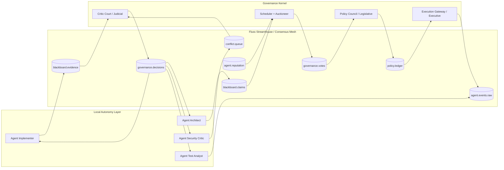
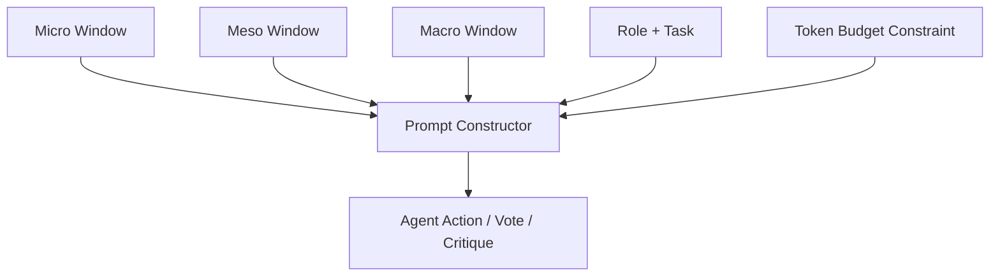

# Agent Civilization Architecture Direction (May 1, 2026)

## Scope
This document synthesizes:
- `docs/ux_multiagent_professionalization_review_apr_2026.md`
- `docs/ux_multiagent_professionalization_review_apr_2026_pt2.md`
- `docs/ux_multiagent_professionalization_review_apr_2026_pt3.md`

It gives a rigorous path from present-day parallel subagents to a Fluss-centered, policy-governed agent civilization, with no implementation code.

---

## 1. First-principles statement

Define the system as a constrained distributed decision process:

- Environment state space: \(\mathcal{E}\)
- Agent set: \(A = \{a_1,\dots,a_n\}\)
- Policy set: \(\Pi\)
- Evidence stream: \(S(t)\)
- Action set: \(U\)

The orchestration objective is to choose action sequence \(u_{0:T}\) maximizing expected utility:

\[
\max_{u_{0:T}\in U^{T+1}} \; \mathbb{E}[R \mid S(0:T),\Pi]
\]

subject to safety and resource constraints:

\[
\Pr(\text{policy violation}) \leq \epsilon, \quad
\text{cost}(u_{0:T}) \leq B, \quad
\text{latency}(u_t) \leq L.
\]

### Key theorem-like design requirement

A single linear moderator loop is a low-variety controller over a high-variety environment; therefore it is structurally underpowered for high-assurance long-horizon tasks.

Corollary:
A multi-agent civilization is not optional "complexity theater"; it is required to satisfy reliability and throughput constraints simultaneously.

---

## 2. Physics bound: speed of light as lower latency limit

For any coordination event between two compute locations separated by distance \(d\):

\[
\tau_{min} \geq \frac{d}{c}
\]

where \(c\) is speed of light in medium (strict upper bound in vacuum, lower in fiber).

Practical implication:
- Global strong synchronization per micro-decision is provably latency-amplifying.
- Architecture must prefer **local autonomy + selective global synchronization**.

Therefore Fluss should be used as a **selective consensus mesh**, not as a synchronous lock-step bus.

---

## 3. Architectural axioms (must hold)

1. **Axiom A1 (Local decision authority):** Agents execute locally within bounded policy envelopes.
2. **Axiom A2 (Shared causality):** Decisions are externally justified through append-only evidence streams.
3. **Axiom A3 (Conflict preservation):** Minority positions are stored whenever posterior uncertainty exceeds threshold.
4. **Axiom A4 (Risk-proportional governance):** Higher risk decisions require stronger quorum and stronger critic participation.
5. **Axiom A5 (Temporal stratification):** Context must be windowed by timescale (micro/meso/macro) to avoid context entropy collapse.

---

## 4. Fluss-centered reference architecture

### Why this is defensible
- Removes central moderator as single bottleneck.
- Makes all high-value state explicit and replayable.
- Enables asynchronous critique loops without forcing global barriers.

---

## 5. Formal decision protocol

For each proposal \(p\):

- Risk class \(r(p) \in \{\text{routine},\text{risky},\text{policy-change}\}\)
- Votes \(v_i \in \{-1,0,+1\}\) (reject/abstain/approve)
- Confidence \(c_i \in [0,1]\)
- Agent weight \(w_i\) from reputation and calibration

Weighted support:
\[
W(p)=\sum_i w_i c_i v_i
\]

Decision function:
\[
D(p)=
\begin{cases}
\text{approve} & \text{if } W(p)\ge \theta_{r(p)} \wedge Q_{r(p)} \wedge J_{r(p)}\\
\text{defer} & \text{if uncertainty}(p)>u_{max}\\
\text{reject} & \text{otherwise}
\end{cases}
\]

where:
- \(\theta_{r}\): risk-dependent support threshold
- \(Q_r\): quorum condition
- \(J_r\): critic/judicial signoff condition

This is the minimum mechanism for high-assurance democracy with bounded cost.

---

## 6. Temporal windows as computational control surface

Define three context windows:

- Micro \(W_\mu\): recent tool/action events (seconds-minutes)
- Meso \(W_m\): objective-branch reasoning (minutes-hours)
- Macro \(W_M\): policy/reputation/history (hours-weeks)

Context assembly function for agent \(a\):
\[
C_a = f_a(W_\mu, W_m, W_M, \text{role}_a, \text{task}_a)
\]

Constraint:
\[
|C_a| \leq K_a
\]
(token budget)

The system optimizes not for maximum context volume, but maximum marginal information gain per token.

---

## 7. Migration path (short of code)

### Stage 0: Canonical artifacts
- Promote Claim/Evidence/Counterexample/OpenQuestion/Decision to first-class stream entities.
- Enforce evidence-linked decisions as governance invariant.

### Stage 1: Governance kernel
- Introduce risk classes and decision thresholds.
- Add challenge flow with mandatory critic latency budget.

### Stage 2: Reputation-weighted voting
- Calibrate each agent by Brier-like error against realized correctness.
- Update \(w_i\) with floor/cap to avoid dictatorship collapse.

### Stage 3: Market allocation
- Agents submit bid tuples \((\hat p_{success}, \hat c_{tokens}, \hat \ell_{latency})\).
- Scheduler maximizes expected information gain under budget constraints.

### Stage 4: Cross-region optimization
- Place agents near tool/data loci.
- Use Fluss for compact deltas, not full-state synchronization.

---

## 8. Evaluation design (architectural proof obligations)

The architecture is acceptable iff it demonstrates improvements over single-agent and parallel-only baselines on:

1. Pass rate and time-to-first-correct-patch.
2. Cost-adjusted quality (tokens + tool calls).
3. Policy violation interception rate.
4. Disagreement resolution latency.
5. Calibration quality (predicted confidence vs realized correctness).

Ablations required:
- Remove temporal windows.
- Remove weighted voting.
- Remove critic challenge path.
- Remove dynamic role reassignment.

If gains disappear under ablation, the civilization claim is unproven.

---

## 9. Executive direction

Yes: Fluss is the best shot **if** treated as an instantaneous-enough selective streamhouse for causally critical deltas, not as a global lock-step coordinator.

Design target:
- **Local fast loops** for agency.
- **Global evidence mesh** for legitimacy.
- **Risk-scaled democracy** for safety.
- **Temporal windows** for efficiency.

That combination is the shortest rigorous path from today's orchestrator to a true agent civilization.
