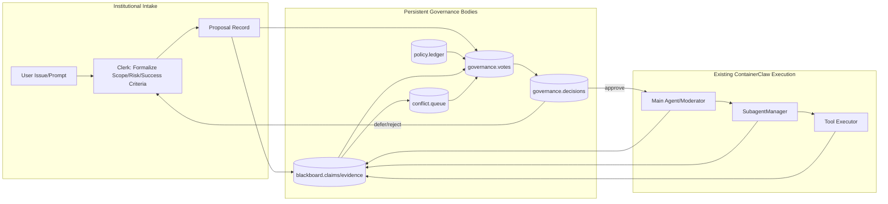
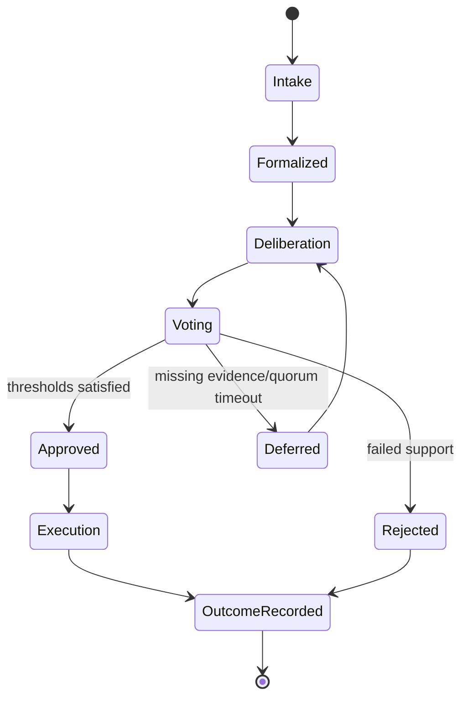
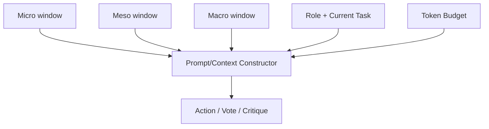

# Agent Institutions for ContainerClaw: Rigorous MVP Path (May 1, 2026)

## Scope
This document extends:
- `docs/ux_multiagent_professionalization_review_apr_2026.md`
- `docs/ux_multiagent_professionalization_review_apr_2026_pt2.md`
- `docs/ux_multiagent_professionalization_review_apr_2026_pt3.md`
- `docs/ux_multiagent_professionalization_review_apr_2026_pt4.md`

It proposes a rigorous, derivable architecture for evolving ContainerClaw from a strong single-threaded execution loop toward persistent agent institutions (governance bodies), while minimizing code churn and preserving current SWE-bench usability.

---

## 1. First-principles problem statement

Let:
- Environment state space: $\mathcal{E}$ (codebase, tools, incidents, user goals)
- Agent set: $A = \{a_1,\dots,a_n\}$
- Policy set (constitution): $\Pi$
- Action set: $U$
- Streamed evidence over time: $S(0:T)$

We seek an action sequence maximizing expected utility:

$$
\max_{u_{0:T}\in U^{T+1}} \; \mathbb{E}[R \mid S(0:T), \Pi]
$$

subject to:

$$
\Pr(\text{policy violation}) \le \epsilon, \quad
\text{cost}(u_{0:T}) \le B, \quad
\text{latency}(u_t) \le L.
$$

### Core theorem-like requirement
A single linear moderator loop is a low-variety controller over a high-variety environment. Therefore, for high-assurance long-horizon software tasks, governance capacity must be increased by explicit institutional process, not just larger prompts or ad hoc subagent fan-out.

Corollary:
The minimal viable next step is to add **institutions** (persistent rules + deliberation protocol + audit trail) around the existing execution path.

---

## 2. Physics bound: speed of light as architecture constraint

For a coordination event across distance $d$:

$$
\tau_{min} \ge \frac{d}{c}
$$

with $c$ the speed of light in medium (vacuum bound; fiber lower).

Implications:
1. Full synchronous global consensus per micro-decision is latency-amplifying by construction.
2. Architecture must be **local-first** (edge autonomy) with **selective global synchronization** for causally critical deltas.
3. Fluss should carry compact institutional state transitions and evidence references, not full lock-step world-state.

This is not an optimization preference; it is a physical lower bound.

---

## 3. High-level concept: from agents to institutions

Current useful system:
- Main agent timeline is smooth.
- Personality/voting mechanisms can improve search quality but impose token overhead.

Missing layer:
- Persistent, rule-bearing governance structure that converts user issues into formal proposals and risk-scaled execution decisions.

### Institutional model
- **Constitution (Policy Ledger):** versioned decision rules, risk classes, quorum thresholds.
- **Council (Deliberative body):** planner + critic + auditor roles.
- **Executive (Existing runtime):** current main agent/subagent/tool path.
- **Judicial checkpoint (Challenge path):** allows risk-based blocking/deferment.
- **Clerk (Intake/Formalization):** turns prompts into proposals with explicit success criteria.

This enables the product metaphor: users submit issues to a standing “agent government,” not merely a transient chat loop.

---

## 4. Reference architecture (MVP-preserving)

### Why this is minimal
- It wraps existing execution rather than replacing it.
- It adds governance checkpoints at proposal and risky action boundaries.
- It creates a durable evidence trail for audit and benchmarks.

---

## 5. Formal process specification (derivable end-to-end)

### 5.1 Entities
- `Issue`: raw user request.
- `Proposal`: formalized objective with risk class and acceptance criteria.
- `Artifact`: one of `{Claim, Evidence, Counterexample, OpenQuestion, Decision}`.
- `Vote`: `(agent_id, proposal_id, vote ∈ {-1,0,+1}, confidence ∈ [0,1], rationale_ref)`.
- `Policy`: versioned constitutional rule object.

### 5.2 Risk classes (MVP)
- `ROUTINE_EXEC`
- `RISKY_EXEC`

### 5.3 Decision function
Let agent weight $w_i$ (initially fixed in MVP), confidence $c_i$, vote $v_i$:

$$
W(p)=\sum_i w_i c_i v_i
$$

Decision:

$$
D(p)=
\begin{cases}
\text{approve} & \text{if } W(p)\ge\theta_{r(p)} \wedge Q_{r(p)} \wedge J_{r(p)} \\
\text{defer} & \text{if evidence\_insufficient}(p) \\
\text{reject} & \text{otherwise}
\end{cases}
$$

where:
- $\theta_{r}$ = risk-dependent threshold
- $Q_r$ = quorum rule
- $J_r$ = critic/judicial condition (mandatory for risky class)

### 5.4 Process state machine

Every transition emits an event. Every terminal state records rationale and evidence references.

---

## 6. Temporal-windowed context control

Use three context windows per deliberation/execution cycle:
- **Micro** $W_\mu$: immediate tool/action outcomes.
- **Meso** $W_m$: objective branch history.
- **Macro** $W_M$: constitutional rules + precedent + agent calibration traces.

Prompt/context constructor:

$$
C_a = f_a(W_\mu, W_m, W_M, role_a, task_a), \quad |C_a| \le K_a
$$

Goal: maximize marginal information gain per token, not raw context volume.

---

## 7. Global board vs local board: institutional resolution

Adopt hybrid hierarchy:
1. **Global Governance Board** (canonical): proposals, votes, decisions, policy deltas.
2. **Local Work Boards** (per objective/thread): implementation artifacts and tactical status.
3. Linkage keys: `proposal_id`, `objective_id`, `parent_artifact_id`.

This preserves local velocity while maintaining global democratic legitimacy.

---

## 8. Minimal code-change plan (single iterative step)

### Step S1 (MVP-0): Governance Overlay
Implement only what is necessary to create institutional behavior:

1. Add structured artifact schema and event types:
   - `Claim`, `Evidence`, `Counterexample`, `OpenQuestion`, `Decision`
   - `Proposal`, `Vote`
2. Add intake formalization hook:
   - transform user prompt to proposal with risk class + success criteria.
3. Add pre-execution governance gate for risky actions:
   - routine actions pass simple majority path
   - risky actions require critic signoff
4. Append all outcomes to policy/audit-visible streams.

No scheduler rewrite, no auction market, no dynamic reputation math required yet.

---

## 9. Exhaustive defense of proposed code changes

### Change class A: Schema/event additions
**Defense:** Without typed institutional artifacts, collaboration is implicit and non-auditable; no rigorous governance can be derived from unstructured chat/events.

### Change class B: Intake formalization
**Defense:** Governance requires proposals with explicit objective/risk/acceptance criteria. Raw prompts are insufficient for constitutional decision rules.

### Change class C: Risk-gated decision hook
**Defense:** Democratic governance is operationally meaningless if all actions bypass vote/check logic. A single gate on risky transitions creates real policy enforcement with minimal disruption.

### Change class D: Canonical ledgering
**Defense:** Benchmarkability and trust require replayable causal logs. If decisions and evidence are not durably linked, postmortem-grade verification is impossible.

### Change class E: Hybrid board linkage
**Defense:** Pure global board overloads operators; pure local boards fracture legitimacy. Hierarchical linkage yields both autonomy and traceability.

---

## 10. Evaluation obligations (prove MVP value)

MVP is accepted iff it improves or preserves:
1. SWE-bench pass behavior vs baseline.
2. Time-to-first-correct-patch.
3. Cost-adjusted quality (tokens + tool calls).
4. Risky-action interception / policy-violation avoidance.
5. Disagreement handling latency and outcome clarity.

Required ablation checks:
- remove governance gate,
- remove artifact typing,
- remove critic signoff for risky class.

If benefits vanish, institutional layer is not yet justified.

---

## 11. Practical product definition (MVP)

**Product statement:**
ContainerClaw becomes a persistent agent governance runtime where users submit issues to institutional intake, receive policy-grounded decisions, and execute through existing high-performance agent timelines.

**User-visible MVP surfaces:**
- Issue intake + formalization card.
- Proposal/vote/decision timeline.
- Linked execution trace.
- Constitution/policy panel (versioned).

This is the smallest credible step from single-thread orchestration to democratic agent institutions.

---

## 12. Executive summary

- Do not replace the current execution engine.
- Add a persistent governance overlay as constitutional wrapper.
- Use Fluss as selective consensus mesh, constrained by physical latency limits.
- Enforce proposal formalization + risk-scaled vote gating + durable evidence linkage.

That single step is sufficient to begin the transition from “agent toolchain” to “agent civilization” while controlling complexity growth.
